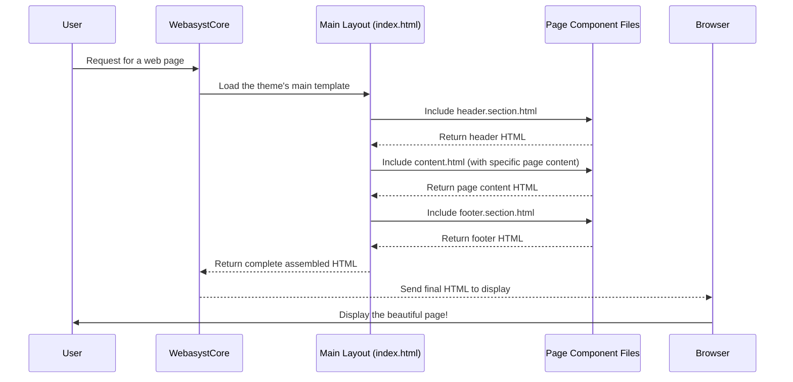

# Chapter 2: Page Layout Components

In [Chapter 1: Site Structure & Navigation](01_site_structure___navigation_.md), we learned how to organize your website's content into a logical hierarchy, making it easy for visitors to find specific pages. Now that you know *what* content goes *where*, let's talk about *how* that content is presented on the screen.

Imagine you're building a house. You've decided where the kitchen, living room, and bedrooms go (that's your site structure!). But every house also has a roof, a front door, and a foundation – parts that are always there, no matter what's inside the rooms. These consistent parts are like "Page Layout Components" for your website.

## What are Page Layout Components?

Page layout components are reusable building blocks that define the overall structure and common elements of your website pages. They are like a blueprint for your website's visual appearance, ensuring that certain sections always appear in the same place and look consistent across all (or many) pages.

This helps solve a big problem: if you had to design the top navigation, logo, footer, and other common elements for *every single page* separately, it would be a huge amount of work! And if you wanted to change your logo, you'd have to update hundreds of files. Webasyst's layout components solve this by allowing you to define these common areas once and reuse them everywhere.

Think of it like using LEGO bricks: you have specialized bricks for the roof, the walls, and the base. You assemble them to create a house, but each brick is designed to fit perfectly with others.

### Common Components You'll Find:

*   **Header:** The very top section of your website, often containing your logo, site title, main navigation menu, and perhaps search bar or user login links.
*   **Footer:** The very bottom section, typically showing copyright information, privacy policy links, social media icons, or contact details.
*   **Main Content Area:** This is the central part of the page where the unique content for *that specific page* (the "About Us" text, the "Our Products" list, etc.) is displayed.
*   **Sidebar:** An optional section often found on the left or right of the main content, used for secondary navigation, ads, or quick links.

By separating these components, Webasyst allows for a modular and flexible design. You can update one component (like the header) and the change automatically appears on all pages that use it.

## How Webasyst Uses Layout Components

Webasyst themes (which we'll discuss in detail in [Themes (Design Families)](03_themes__design_families_.md)) are built using these layout components. The magic happens through a special command in Webasyst's [Templating System (Smarty)](04_templating_system__smarty_.md) called `{include}`.

### The Master Blueprint: `index.html`

Every Webasyst website theme has a main template file, usually named `index.html`. This file acts as the "master blueprint" for your entire website. It's not where your unique page content lives, but rather where all the common layout components are brought together.

Let's look at a simplified `index.html` file from a Webasyst theme (like `wa-apps/site/themes/clear/index.html`):

```smarty
<!DOCTYPE html>
<html>
<head>
    {* ... (meta tags, CSS, JavaScript links, etc.) ... *}
</head>
<body id="{$wa_app}">
    <!-- HEADER -->
    {include file="header.section.html" inline}

    <div id="main">
        <div class="container">
            {* ... (main title, etc.) ... *}
            <!-- INTERNAL APP NAVIGATION & CONTENT -->
            {include file="`$wa_active_theme_path`/content.html" inline}
            <div class="clear-both"></div>
        </div>
    </div>

    <!-- FOOTER -->
    {include file="footer.section.html" inline}

</body>
</html>
```

**Explanation:**

*   **`<!DOCTYPE html>` to `</html>`**: This is the basic structure of any web page.
*   **`<head>` section**: This part usually contains technical information about your page (like its title, keywords for search engines, links to CSS styles, and JavaScript files).
*   **`<body>` section**: This is where all the visible content of your web page goes.
*   **`{include file="header.section.html" inline}`**: This is the key! It's a Smarty command that tells Webasyst: "Go find the file named `header.section.html` and insert all its content right here." This file contains the HTML for your website's header.
*   **`{include file="`$wa_active_theme_path`/content.html" inline}`**: Similarly, this line tells Webasyst to insert the content of `content.html`. This file is special because it's where the actual unique content of *the current page* will be displayed.
*   **`{include file="footer.section.html" inline}`**: This brings in the HTML for your website's footer.

These `{include}` statements are powerful because they allow you to build complex pages from simpler, reusable parts.

### The Component Files: Header, Footer, and Content

Now, let's peek inside those `*.section.html` and `content.html` files.

#### 1. The Header (`header.section.html`)

This file contains the HTML code for your website's header.

```smarty
<div id="header">
    <div class="container" role="navigation">

        {if $wa->shop}
            {* ... shopping cart info if Shop-Script is installed ... *}
        {/if}

        {if $wa->isAuthEnabled()}
            {* ... user login/signup links ... *}
        {/if}

        {* ... search form ... *}

        <!-- main website sections -->
        <ul class="menu-h">
            {foreach $wa->apps() as $a}
                <li{if $a.url==$wa_app_url} class="selected"{/if}><a href="{$a.url}">{$a.name}</a></li>
            {/foreach}
        </ul>

        <div class="clear-both"></div>

    </div>
</div>
```

**Explanation:**
This snippet (from `wa-apps/site/themes/clear/header.section.html`) shows common elements for a header:
*   A main `div` with `id="header"`.
*   Code that might show shopping cart info (if Shop-Script app is installed).
*   Code for login/signup links.
*   A basic navigation menu, possibly listing your main applications (like "Site", "Shop", "Blog").

#### 2. The Footer (`footer.section.html`)

This file holds the HTML for your website's footer.

```smarty
<div id="footer">
    <div class="container">
        <div class="hr"></div>
        {include file="`$wa_active_theme_path`/footer.html" inline}
        {* ... optional extra content ... *}
        {if !empty($theme_settings.footer_notice)}
            <div style="clear: both"></div>
            <div class="s-footer-notice">{$theme_settings.footer_notice}</div>
        {/if}
    </div>
</div>
```

**Explanation:**
This (from `wa-apps/site/themes/clear/footer.section.html`) defines the footer area:
*   A main `div` with `id="footer"`.
*   It might even *include* another smaller footer file (`footer.html`) for even more modularity.
*   Placeholders for copyright notices or other footer-specific content.

#### 3. The Content Area (`content.html` or `page.html`)

This is where the unique content of your current page appears. The `index.html` file *includes* `content.html`, and `content.html` (or sometimes another template like `page.html` which is included by `content.html`) then displays the actual content you typed in the Webasyst backend for that specific page.

Here's `content.html` (from `wa-apps/site/themes/clear/content.html`):

```smarty
<div class="content">
    {if $wa->currentUrl() == $wa_app_url && !empty($error_code) && $error_code == 404}
        {* ... welcome message for new sites or 404 error ... *}
    {else}
        {$content}
    {/if}
</div>
```

And here's `page.html` (from `wa-apps/site/themes/clear/page.html`), which is often included *by* `content.html` or directly handles page display:

```smarty
<div class="page" role="main">
    <!-- navigation breadcrumbs -->
    {if !empty($breadcrumbs)}
        <div class="breadcrumbs">
            {foreach $breadcrumbs as $breadcrumb}
                <a href="{$breadcrumb.url}">{$breadcrumb.name|escape}</a> <span class="rarr">&rarr;</span>
            {/foreach}
        </div>
    {/if}
    <h1>{$page.name}</h1>
    {$page.content}
</div>
```

**Explanation:**
*   **`{$content}`**: This is the most crucial part for displaying your page content! When you create a page in the Webasyst backend and type text into its content editor, that text is stored. The `$content` variable is where Webasyst "injects" that specific page's content into the overall layout.
*   `$page.name` and `$page.content`: In `page.html`, `{$page.name}` automatically displays the title of your current page, and `{$page.content}` displays the content you entered for that page.
*   `$breadcrumbs`: As we saw in Chapter 1, this variable holds the path to the current page, allowing for "Home > Products > Cakes" navigation.

## Under the Hood: How Components Are Assembled

Let's trace what happens when a visitor requests a page on your Webasyst website and how these components are put together.



1.  **User Request:** A user's web browser sends a request to your Webasyst website for a specific page (e.g., `/about-us/`).
2.  **Webasyst Core:** The Webasyst core system receives the request and identifies which theme is active for your website.
3.  **Load Main Layout:** Webasyst tells its templating engine (Smarty) to load the main template file, `index.html`, from your active theme.
4.  **Component Inclusion:** As Smarty processes `index.html`, it encounters the `{include}` commands:
    *   It first sees `{include file="header.section.html" ...}`. It goes, finds, and inserts the content of `header.section.html`.
    *   Then, it sees `{include file="content.html" ...}`. Before including this, Webasyst has already prepared the *specific content* for the `/about-us/` page (the text you wrote in the backend). It makes this content available via the `$content` (or `$page.content`) variable inside `content.html` or `page.html`.
    *   Finally, it sees `{include file="footer.section.html" ...}` and inserts the footer's content.
5.  **Assemble HTML:** As each component's HTML is processed, it's combined into one complete HTML document.
6.  **Send to Browser:** The fully assembled HTML document is then sent back to the user's browser.
7.  **Display Page:** The browser renders this HTML, and the user sees your consistent, well-structured web page with the correct header, footer, and the unique "About Us" content.

This process ensures that your common website elements are always present and correctly positioned, while the specific page content remains flexible.

## Conclusion

In this chapter, we've explored Page Layout Components, understanding them as the reusable building blocks (like headers, footers, and content areas) that give your website a consistent look and feel. We saw how the `index.html` file acts as the master blueprint, using `{include}` commands to pull together various component files. This modular approach ensures design consistency and makes future updates much easier.

Now that we understand how pages are structured and assembled, let's dive deeper into how Webasyst manages the overall visual style and theme of your website in [Themes (Design Families)](03_themes__design_families_.md).

---

<sub><sup>Generated by [AI Codebase Knowledge Builder](https://github.com/The-Pocket/Tutorial-Codebase-Knowledge).</sup></sub> <sub><sup>**References**: [[1]](https://github.com/webasyst/webasyst-framework/blob/321a9006a656fcf561c0295b87510be1e861d758/wa-apps/site/themes/clear/content.html), [[2]](https://github.com/webasyst/webasyst-framework/blob/321a9006a656fcf561c0295b87510be1e861d758/wa-apps/site/themes/clear/footer.section.html), [[3]](https://github.com/webasyst/webasyst-framework/blob/321a9006a656fcf561c0295b87510be1e861d758/wa-apps/site/themes/clear/header.section.html), [[4]](https://github.com/webasyst/webasyst-framework/blob/321a9006a656fcf561c0295b87510be1e861d758/wa-apps/site/themes/clear/index.html), [[5]](https://github.com/webasyst/webasyst-framework/blob/321a9006a656fcf561c0295b87510be1e861d758/wa-apps/site/themes/clear/page.html), [[6]](https://github.com/webasyst/webasyst-framework/blob/321a9006a656fcf561c0295b87510be1e861d758/wa-apps/site/themes/default2/footer.html), [[7]](https://github.com/webasyst/webasyst-framework/blob/321a9006a656fcf561c0295b87510be1e861d758/wa-apps/site/themes/default2/header.html), [[8]](https://github.com/webasyst/webasyst-framework/blob/321a9006a656fcf561c0295b87510be1e861d758/wa-apps/site/themes/default2/main.html)</sup></sub>
