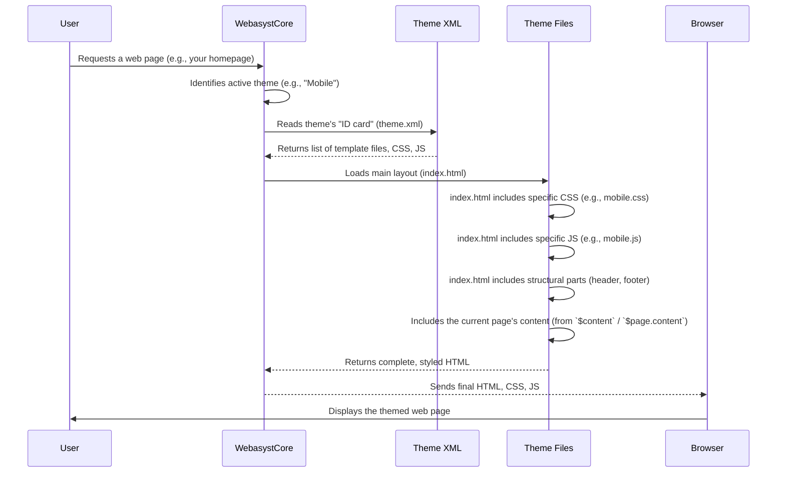

# Chapter 3: Themes (Design Families)

In [Chapter 1: Site Structure & Navigation](01_site_structure___navigation_.md), you learned how to organize your website's pages and create menus. Then, in [Chapter 2: Page Layout Components](02_page_layout_components_.md), we explored how these pages are assembled using reusable blocks like headers and footers. Now, imagine you have a well-organized website with all its parts in place. What if you want to change its entire look and feel? From a classic blog to a mobile-friendly app, or even a website designed to look like a social media page?

This is where **Themes (Design Families)** come into play!

## What is a Theme?

Think of your website's content and structure as the skeleton and internal organs of a living being. A **Theme** is like the **outfit** it wears!

*   A theme dictates your website's **visual presentation**: colors, fonts, spacing, background images, and overall design.
*   It also defines the **structural presentation**: how content blocks are arranged, where sidebars appear, and how elements respond to different screen sizes.
*   Sometimes, a theme can even change how your site **behaves** slightly, like optimizing for mobile devices or integrating with social media platforms.

The amazing part is that when you switch themes, your core content (the text, images, and pages you created) *remains the same*. Only its "outfit" changes! This is a core principle in web development: separating content from presentation.

### The Problem It Solves

Imagine you launch your website with a standard "business" look. A year later, you decide you want a more modern, minimalist feel, or perhaps you want a version of your site specifically designed for people browsing on their phones.

Without themes, you'd have to manually rewrite tons of code on every single page! This would be a huge, error-prone task. With themes, you simply choose a new "outfit" in your Webasyst backend, and your entire website transforms instantly.

## The Building Blocks of a Theme

A theme is a collection of files that work together to create the visual and interactive experience. These typically include:

1.  **HTML Template Files (Smarty):** These are the `*.html` files we saw in Chapter 2 (like `index.html`, `header.section.html`, `page.html`). They define the layout and structure where your content will be placed.
2.  **CSS Files (Cascading Style Sheets):** These are `*.css` files that contain all the style rules. They tell the browser how HTML elements should look (e.g., "all headings should be blue," "this button should be rounded," "the background should be a certain image").
3.  **JavaScript Files (JS):** These are `*.js` files that add interactivity and dynamic behavior to your site (e.g., animations, dropdown menus, image sliders).
4.  **Images and other Assets:** These are pictures, icons, and other media files that are part of the theme's design.
5.  **`theme.xml` File:** This is a special file that acts as the theme's "ID card" or "blueprint." It tells Webasyst everything about the theme: its name, description, which files it uses, and any special settings it offers.

## How to Use Themes

Switching your website's theme in Webasyst is incredibly easy, even for beginners.

### Step-by-Step: Changing Your Website's Theme

1.  **Log in to your Webasyst backend.** This is your administration area.
2.  **Go to the "Site" application.** You'll usually find it in the left sidebar.
3.  **Click on "Themes."** This section shows you all the themes installed on your Webasyst site.
4.  **Browse Available Themes:** You'll see a list of themes like "Clear," "Default 2.0," "Custom," "Facebook," "Mobile," and "Nifty." Each one offers a different look.
5.  **Select a Theme:** Click on a theme to see its preview.
6.  **Activate a Theme:** If you like it, click the "Apply" or "Install" button. Webasyst will instantly change your website's live appearance!

### Experiencing Different "Outfits"

Let's look at how themes can dramatically change your site:

*   **Standard Desktop Theme (e.g., "Clear" or "Default 2.0"):** These themes provide a balanced, responsive design suitable for most websites viewed on desktops, tablets, and phones. They usually have a standard header, main content area, and footer.

*   **Mobile Theme (e.g., "Mobile"):** If you activate a theme like "Mobile," your website will completely transform to look and feel like a native mobile app. It might feature a "hamburger" menu (three lines) to hide navigation, large touch-friendly buttons, and content optimized for smaller screens.

    This theme provides specific settings, as seen in its `theme.xml` file:
    ```xml
    <theme id="mobile" system="0" vendor="webasyst" author="Webasyst" app="site" version="1.3.15">
        <name locale="en_US">Mobile</name>
        <description locale="en_US">Theme for mobile devices</description>
        <files>
            <file path="mobile.css" custom="0"/>
            <file path="mobile.js" custom="0"/>
            <!-- ... other files like index.html, page.html ... -->
        </files>
        <settings>
            <setting var="logo" control_type="image">
                <name locale="en_US">Slide-out menu logo</name>
            </setting>
            <setting var="pagination" control_type="select">
                <name locale="en_US">Displaying of long product lists</name>
                <options>
                    <option value="lazyloading">
                        <name locale="en_US">Automatically load content on page scrolling</name>
                    </option>
                    <option value="paging">
                        <name locale="en_US">Paginated lists (1 2 3 4)</name>
                    </option>
                </options>
            </setting>
            <!-- ... more settings ... -->
        </settings>
        <!-- ... more theme details ... -->
    </theme>
    ```
    **Explanation:**
    *   The `id="mobile"` identifies this theme uniquely.
    *   The `<description>` clearly states its purpose: "Theme for mobile devices."
    *   It lists its unique styling (`mobile.css`) and scripting (`mobile.js`) files.
    *   The `<settings>` section shows custom options like adding a `logo` for the slide-out menu or choosing how `pagination` (page numbers vs. auto-load) works for long lists, which are specific to mobile browsing.

*   **Social Media Theme (e.g., "Facebook" or "VK"):** These themes make your website look like an embedded application within Facebook or VK.com, complete with integration settings for app IDs. They change the layout to fit within an `iframe` (a webpage embedded inside another webpage) and adopt the social network's style.

    Here's a snippet from the `Facebook` theme's `theme.xml`:
    ```xml
    <theme id="facebook" system="0" vendor="webasyst" author="Webasyst" app="site" version="1.2.14">
        <name locale="en_US">Facebook</name>
        <description locale="en_US">Your site inside Facebook as an iframe app.</description>
        <files>
            <file path="index.html" custom="0"/>
            <file path="facebook.css" custom="0"/>
            <file path="facebook.js" custom="0"/>
            <!-- ... other files ... -->
        </files>
        <settings>
            <setting var="facebook_app_id" control_type="text">
                <value>YOUR_FACEBOOK_APP_ID</value>
                <name locale="en_US">Facebook App ID</name>
            </setting>
            <!-- ... more settings ... -->
        </settings>
        <!-- ... more theme details ... -->
    </theme>
    ```
    **Explanation:**
    *   The `id="facebook"` identifies this theme.
    *   The description highlights its purpose: "Your site inside Facebook as an iframe app."
    *   It includes `facebook.css` and `facebook.js` for its unique look and behavior.
    *   It has a special `facebook_app_id` setting, which is crucial for integrating your site as a Facebook application.

Each theme comes with its own set of template files, stylesheets, and scripts, allowing for vast differences in design and functionality.

## Under the Hood: How Themes Are Applied

When you select a theme, or when a visitor browses your website, Webasyst performs a series of steps to apply the chosen "outfit."



1.  **Request:** A user's browser asks your Webasyst website for a page.
2.  **Theme Identification:** The Webasyst core system quickly identifies which theme is currently active for your website (e.g., "Mobile" theme).
3.  **Theme `theme.xml` Lookup:** Webasyst consults the selected theme's `theme.xml` file. This file tells Webasyst exactly *which* template files (`index.html`, `page.html`, etc.), CSS files (`.css`), and JavaScript files (`.js`) belong to this specific theme.
4.  **Assembly:** Using the `index.html` file (as we discussed in [Chapter 2: Page Layout Components](02_page_layout_components_.md)) as the master blueprint, Webasyst's [Templating System (Smarty)](04_templating_system__smarty_.md) starts building the HTML for the page.
    *   It loads the specific CSS file(s) defined by the theme (e.g., `mobile.css` for the "Mobile" theme, `facebook.css` for the "Facebook" theme). These files contain all the visual rules.
    *   It loads the specific JavaScript file(s) (e.g., `mobile.js`, `facebook.js`) to add any interactive elements unique to that theme.
    *   It fills in the content from your pages (like your "About Us" text) into the theme's templates.
5.  **Delivery:** The fully assembled HTML, along with the correct CSS and JavaScript, is sent to the user's browser.
6.  **Display:** The browser renders the page, applying all the styles and scripts from the selected theme, resulting in a unique visual experience.

### The Role of `theme.xml` in Detail

The `theme.xml` file is more than just an ID card; it's the instruction manual for Webasyst on how to use the theme.

Let's look at key parts of a typical `theme.xml` (simplified from `wa-apps/site/themes/default2/theme.xml`):

```xml
<?xml version="1.0" encoding="UTF-8"?>
<!DOCTYPE theme PUBLIC "wa-app-theme" "http://www.webasyst.com/wa-content/xml/wa-app-theme.dtd">
<theme id="default2" system="0" vendor="webasyst" author="Webasyst" app="site" version="2.3.7">
    <name locale="en_US">Default 2.0</name>
    <description locale="en_US">Adaptive design theme for all base Webasyst apps</description>
    <files>
        <file path="index.html" custom="0">
            <description locale="en_US">Core layout of Default 2.0 theme family</description>
        </file>
        <file path="default.css" custom="0">
            <description locale="en_US">Core CSS of the Default 2.0 theme family</description>
        </file>
        <file path="head.html" custom="0">
            <description locale="en_US">Site app's &lt;head&gt; instructions</description>
        </file>
        <file path="page.html" custom="0">
            <description locale="en_US">Static page content and navigation</description>
        </file>
        <!-- ... many more <file> entries ... -->
    </files>
    <about locale="en_US">
        <![CDATA[
        <p><b>Default</b> is a universal adaptive design theme family...</p>
        ]]>
    </about>
    <settings>
        <setting var="logo" control_type="image">
            <value></value>
            <filename>img/logo.*</filename>
            <name locale="en_US">Logo</name>
        </setting>
        <setting var="color_scheme" control_type="image_select">
            <value>img/backgrounds/themesettings/green.png</value>
            <name locale="en_US">Color scheme</name>
            <options>
                <option value="img/backgrounds/themesettings/green.png"></option>
                <!-- ... other color options ... -->
            </options>
        </setting>
        <setting var="font_size_toggle" control_type="select">
            <value>font_size_14</value>
            <name locale="en_US">Main text font size</name>
            <options>
                <option value="font_size_12"></option>
                <!-- ... other font size options ... -->
            </options>
        </setting>
        <!-- ... many more <setting> entries ... -->
    </settings>
</theme>
```
**Explanation:**
*   **`<theme id="..."`:** This is the unique identifier for the theme.
*   **`<name>` and `<description>`:** Provide the theme's human-readable name and a brief overview, displayed in the Webasyst backend.
*   **`<files>`:** This section lists *all* the template, CSS, and JavaScript files that make up this theme. When Webasyst needs to render a page with this theme, it knows which files to look for. The `custom="0"` means these are core theme files, not user-customized ones.
*   **`<about>`:** This section contains a more detailed description of the theme, often including instructions or special features.
*   **`<settings>`:** This is a powerful part! It defines all the customizable options for the theme that you can change directly from the Webasyst backend without touching any code.
    *   `var`: The internal name of the setting.
    *   `control_type`: What kind of input field it is (e.g., `text` for text input, `image` for image upload, `select` for a dropdown list, `checkbox` for a toggle).
    *   `name`: The label displayed in the backend.
    *   `value`: The default value.
    *   `options`: For `select` type settings, defines the choices available.

These settings allow theme developers to build flexible themes that users can easily tweak (like changing a logo, color scheme, or font size) without needing to write any code.

## Conclusion

In this chapter, we've uncovered the concept of **Themes** in `webasyst-framework`. We learned that themes are like different "outfits" for your website, controlling its entire visual and structural presentation, while keeping your core content separate. We explored how easy it is to switch themes in the Webasyst backend and saw how different themes like "Mobile" or "Facebook" dramatically alter the look and even behavior of your site. Finally, we looked under the hood at the `theme.xml` file, understanding how it acts as the theme's blueprint, listing its files and providing customizable settings.

Understanding themes is crucial because it allows you to brand your website and adapt its appearance for various purposes or devices, all without modifying your hard-earned content.

Next, we'll dive deeper into the special language themes use to dynamically display content and bring these "outfits" to life: [Templating System (Smarty)](04_templating_system__smarty_.md).

---

<sub><sup>**References**: [[1]](https://github.com/webasyst/webasyst-framework/blob/321a9006a656fcf561c0295b87510be1e861d758/wa-apps/site/themes/clear/theme.xml), [[2]](https://github.com/webasyst/webasyst-framework/blob/321a9006a656fcf561c0295b87510be1e861d758/wa-apps/site/themes/custom/theme.xml), [[3]](https://github.com/webasyst/webasyst-framework/blob/321a9006a656fcf561c0295b87510be1e861d758/wa-apps/site/themes/default2/theme.xml), [[4]](https://github.com/webasyst/webasyst-framework/blob/321a9006a656fcf561c0295b87510be1e861d758/wa-apps/site/themes/facebook/theme.xml), [[5]](https://github.com/webasyst/webasyst-framework/blob/321a9006a656fcf561c0295b87510be1e861d758/wa-apps/site/themes/mobile/theme.xml), [[6]](https://github.com/webasyst/webasyst-framework/blob/321a9006a656fcf561c0295b87510be1e861d758/wa-apps/site/themes/nifty/theme.xml), [[7]](https://github.com/webasyst/webasyst-framework/blob/321a9006a656fcf561c0295b87510be1e861d758/wa-apps/site/themes/sidebar/theme.xml), [[8]](https://github.com/webasyst/webasyst-framework/blob/321a9006a656fcf561c0295b87510be1e861d758/wa-apps/site/themes/vk/theme.xml)</sup></sub>
