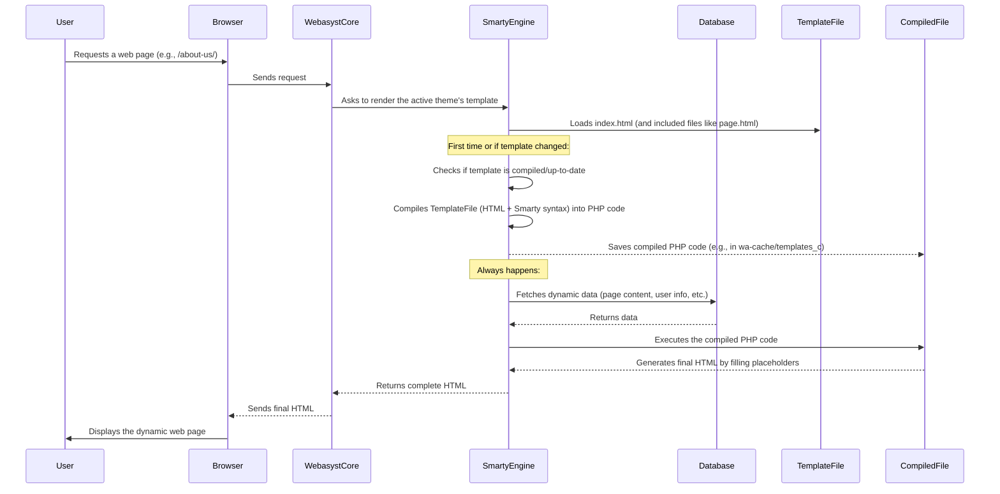

# Chapter 4: Templating System (Smarty)

In [Chapter 3: Themes (Design Families)](03_themes__design_families_.md), we explored how themes give your website its entire "outfit"—its visual style and overall structure. But an outfit needs dynamic patterns and text to truly come alive. Imagine a t-shirt that changes its message depending on who wears it, or a billboard that shows a different ad based on the time of day. This is where the **Templating System** comes in!

## What is a Templating System?

At its core, a templating system is like a **smart fill-in-the-blanks document** for your web pages. Instead of writing the same HTML code repeatedly for every single page (like headers, footers, navigation), you create reusable templates. These templates have special "placeholders" or "blanks."

When someone visits your website, the templating system "fills in these blanks" with dynamic (changing) data, such as:

*   The current page's title
*   The user's name (if they're logged in)
*   A list of blog posts
*   Shopping cart contents

This process then generates the final, complete HTML output, which your user's browser displays.

### The Problem It Solves

Think about a website with hundreds of pages. Every page needs a consistent header, navigation menu, and footer.

*   **Without a templating system:** If you wanted to change your logo or add a new menu item, you'd have to manually edit hundreds of HTML files. This is slow, error-prone, and painful!
*   **With a templating system:** You define the header, footer, and other common elements *once* in a template. When you want to change something, you update just that one template file, and the change magically appears across your entire website. It's incredibly efficient and ensures consistency.

It elegantly separates your website's **content** (what's on the page) from its **presentation** (how it looks and is structured), making development and maintenance much easier.

## Meet Smarty: Webasyst's Templating Engine

Webasyst uses a powerful and popular templating engine called **Smarty**. Smarty allows web designers and developers to create these "fill-in-the-blanks" HTML templates using a simple, intuitive syntax. It's designed to keep your design (HTML/CSS) clean and separate from your website's logic (PHP code).

Let's look at the basic "ingredients" of Smarty that you'll see in Webasyst theme files:

### 1. Variables (The "Blanks")

Variables are the most fundamental type of "blank" in your templates. They start and end with curly braces `{$` and `}`. They hold dynamic data that Webasyst provides.

**Example from `wa-apps/site/themes/clear/index.html`:**

```smarty
<title>{$wa->title()|escape}</title>
<meta name="keywords" content="{$wa->meta('keywords')|escape}" />
<meta name="description" content="{$wa->meta('description')|escape}" />
```

*   `{$wa->title()}`: This placeholder will be replaced with the exact title of the current web page.
*   `{$wa->meta('keywords')}`: This will be replaced by the meta keywords defined for the page.
*   `{$wa->meta('description')}`: This will display the meta description.

**Another common example for page content:**

```smarty
<h1>{$page.name}</h1>
{$page.content}
```

*   `{$page.name}`: This variable holds the title of the specific page you're currently viewing.
*   `{$page.content}`: This holds all the text and images you've entered as the main content for that page in the Webasyst backend.

When Webasyst processes this, it replaces `{$page.name}` with "About Us" and `{$page.content}` with the detailed text you wrote about your company.

### 2. Modifiers (Tools for Blanks)

Sometimes, you need to change how a variable's content is displayed. Modifiers are like small tools you can apply to a variable by adding a pipe `|` symbol followed by the modifier name.

**Example from `wa-apps/site/themes/clear/index.html`:**

```smarty
<title>{$wa->title()|escape}</title>
```

*   `|escape`: This is a crucial modifier. It makes sure that any special characters in the title (like `<` or `>`) are converted into safe HTML codes (like `&lt;` or `&gt;`). This prevents security issues and ensures your HTML code doesn't break.

### 3. Functions (Special Instructions)

Functions are special commands in Smarty that perform an action, not just display data. They also start and end with curly braces, but they don't have a `$` sign.

**Example of including other template files (from `wa-apps/site/themes/clear/index.html`):**

```smarty
    <!-- HEADER -->
    {include file="header.section.html" inline}

    <div id="main">
        {* ... *}
        <!-- INTERNAL APP NAVIGATION & CONTENT -->
        {include file="`$wa_active_theme_path`/content.html" inline}
        {* ... *}
    </div>

    <!-- FOOTER -->
    {include file="footer.section.html" inline}
```

*   `{include file="header.section.html" inline}`: As we saw in [Chapter 2: Page Layout Components](02_page_layout_components_.md), this Smarty function tells the system to take all the HTML from the `header.section.html` file and insert it right here. This is how themes reuse headers, footers, and other layout components.
*   `{$wa_active_theme_path}`: This is another variable that holds the path to your current theme's directory, ensuring the `content.html` file is loaded from the correct place.

**Example of a Webasyst-specific helper function (from [Chapter 1: Site Structure & Navigation](01_site_structure___navigation_.md)):**

```smarty
{wa_print_tree tree=$wa->site->pages() class="menu-h dropdown" elem ='<a href=":url">:name</a>'}
```

*   `wa_print_tree`: This is a custom Webasyst function designed to generate an entire HTML navigation menu from a list of pages. It's a powerful shortcut!

### 4. Control Structures (Smart Rules)

Control structures allow your templates to make decisions or repeat actions, adding dynamic behavior without writing complex logic directly in the HTML.

**Example of an `if` statement (from `wa-apps/site/themes/default2/index.html`):**

```smarty
{if $wa->shop}
    {* ... shopping cart related code ... *}
{/if}
```

*   `{if $wa->shop}`: This checks if the Shop-Script application is installed and active. If it is, then all the Smarty code between `{if}` and `{/if}` will be processed (e.g., displaying shopping cart information). If Shop-Script is not active, this section will be entirely skipped, and nothing will be displayed. This keeps your templates clean!

**Example of a `foreach` loop (from [Chapter 1: Site Structure & Navigation](01_site_structure___navigation_.md)):**

```smarty
{foreach $pages as $p}
   <li><a href="{$p.url}">{$p.name}</a></li>
{/foreach}
```

*   `{foreach $pages as $p}`: This is a loop. It tells Smarty to go through each item in the `$pages` variable (which contains a list of your website's pages). For each page, it temporarily calls it `$p`.
*   `<li><a href="{$p.url}">{$p.name}</a></li>`: Inside the loop, for *each* page `$p`, it creates a list item `<li>` with a link `<a>`. The link's `href` attribute is filled with `{$p.url}` (the page's web address), and the visible text of the link is `{$p.name}` (the page's title).

This loop automatically generates a navigation menu for all your pages without you having to manually write `<li>` tags for each one!

## Putting it All Together: Dynamic Pages

Let's look at how these Smarty elements work together in a typical Webasyst theme to build a page.

Imagine you're visiting your "About Us" page.

1.  **The `index.html` Blueprint:** The main `index.html` file of your theme starts building the basic HTML structure (`<html>`, `<head>`, `<body>`). It uses variables like `{$wa->title()}` for the browser tab title.

2.  **Including Layout Components:** `index.html` then uses `{include}` functions to pull in the header (`header.section.html`), the main content area (`content.html`), and the footer (`footer.section.html`).

3.  **Displaying Page-Specific Content:** Inside `content.html` (or a file it includes, like `page.html`), you'll find placeholders like `{$page.name}` and `{$page.content}`. Webasyst intelligently knows you're on the "About Us" page, so it populates `{$page.name}` with "About Us" and `{$page.content}` with the text you wrote for that page in the Webasyst backend.

4.  **Dynamic Navigation:** In `header.section.html` or `content.html`, you might have a `{foreach}` loop or a `wa_print_tree` function (like we saw in Chapter 1) that dynamically generates the navigation menu based on your [Site Structure & Navigation](01_site_structure___navigation_.md).

This seamless interplay of variables, functions, and control structures allows a single set of template files to generate unique, dynamic pages for your entire website.

## Under the Hood: How Smarty Works

You've seen how Smarty helps you write templates, but what actually happens when Webasyst uses them to display a page?



Here's a step-by-step breakdown:

1.  **Request:** A user's browser requests a page from your Webasyst site.
2.  **Webasyst Core:** The Webasyst core system receives the request and determines which theme and page content need to be displayed.
3.  **Smarty Engine Invoked:** Webasyst hands over the task of rendering the page's template to the Smarty templating engine.
4.  **Template Loading:** Smarty loads the relevant template files from your active theme (e.g., `index.html`, `page.html`, `header.section.html`, etc.).
5.  **Compilation (The Magic Step):**
    *   The first time a template is used, or if the template file has been changed, Smarty doesn't execute the template directly. Instead, it "compiles" it.
    *   This means Smarty translates the template file (which contains HTML mixed with Smarty's special `{$...}` and `{...}` syntax) into a standard PHP file. This compiled PHP file contains the logic to fetch data and insert it into the HTML structure.
    *   This compiled PHP file is saved in a special cache folder (usually `wa-cache/templates_c`).
    *   **Why compile?** Compiling makes your website much faster! Once a template is compiled, Webasyst doesn't need to re-interpret the Smarty syntax every time. It just runs the plain, fast PHP code.
6.  **Data Fetching:** Before executing the compiled template, Smarty (working with Webasyst) gathers all the necessary dynamic data from the database—like the page content you typed in the backend, your account name, active application information, and so on. This data is then made available to the template's variables (like `$page.content`, `$wa->accountName()`).
7.  **Execution & Generation:** The compiled PHP file is then executed. It uses the fetched data to fill in all the placeholders and perform all the instructions (like includes, loops, and conditionals).
8.  **Final HTML:** The result is a complete, dynamic HTML document.
9.  **Delivery:** This final HTML is sent back through Webasyst to the user's browser, which then displays your beautiful, up-to-date web page.

This clever compilation process ensures that Webasyst can deliver fast-loading, dynamic web pages while giving developers and designers a flexible and easy-to-manage way to create them.

## Conclusion

In this chapter, we've demystified the **Templating System (Smarty)** in `webasyst-framework`. We learned that it's your website's "fill-in-the-blanks" engine, allowing you to create reusable templates with dynamic content. We explored Smarty's key ingredients: variables (`{$variable}`), modifiers (`|escape`), functions (`{include}`), and control structures (`{if}`, `{foreach}`). Understanding these elements is fundamental to customizing and extending your Webasyst site's appearance. We also took a peek under the hood to see how Smarty compiles your templates into efficient PHP code for fast performance.

Now that we understand how pages are built and themed using Smarty, let's look at how different applications within Webasyst (like Shop-Script or Blog) integrate with this system and interact with each other in [Application Integration](05_application_integration_.md).

---

<sub><sup>**References**: [[1]](https://github.com/webasyst/webasyst-framework/blob/321a9006a656fcf561c0295b87510be1e861d758/wa-apps/site/themes/clear/blockpage.layout.html), [[2]](https://github.com/webasyst/webasyst-framework/blob/321a9006a656fcf561c0295b87510be1e861d758/wa-apps/site/themes/clear/index.html), [[3]](https://github.com/webasyst/webasyst-framework/blob/321a9006a656fcf561c0295b87510be1e861d758/wa-apps/site/themes/custom/index.html), [[4]](https://github.com/webasyst/webasyst-framework/blob/321a9006a656fcf561c0295b87510be1e861d758/wa-apps/site/themes/default2/index.html), [[5]](https://github.com/webasyst/webasyst-framework/blob/321a9006a656fcf561c0295b87510be1e861d758/wa-apps/site/themes/facebook/index.html), [[6]](https://github.com/webasyst/webasyst-framework/blob/321a9006a656fcf561c0295b87510be1e861d758/wa-apps/site/themes/mobile/index.html), [[7]](https://github.com/webasyst/webasyst-framework/blob/321a9006a656fcf561c0295b87510be1e861d758/wa-apps/site/themes/nifty/index.html), [[8]](https://github.com/webasyst/webasyst-framework/blob/321a9006a656fcf561c0295b87510be1e861d758/wa-apps/site/themes/sidebar/index.html), [[9]](https://github.com/webasyst/webasyst-framework/blob/321a9006a656fcf561c0295b87510be1e861d758/wa-apps/site/themes/vk/index.html)</sup></sub>
