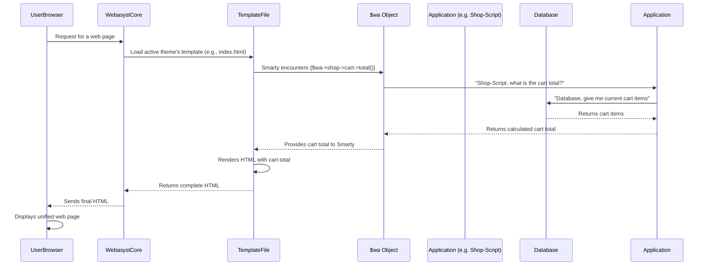

# Chapter 5: Application Integration

In [Chapter 4: Templating System (Smarty)](04_templating_system__smarty_.md), we learned how Webasyst uses Smarty to create dynamic web pages, filling "blanks" in your theme's templates with content. Now, imagine your website isn't just a collection of static pages, but a powerful hub with an online store, a blog, a photo gallery, and more. How do all these specialized "programs" work together seamlessly on the *same* website, sharing information and looking like part of one big system?

This is where **Application Integration** comes in!

## What is Application Integration?

Think of your Webasyst website like a central operating system on a computer. Just as your computer runs various specialized programs (like a word processor, a web browser, or a photo editor), your Webasyst website can run different **applications** (like **Shop-Script** for an online store, **Blog** for blogging, or **Photos** for galleries).

Application Integration is the magic that allows these different Webasyst applications to:

*   **Coexist:** Live on the same website and share a common design (your chosen [Theme (Design Families)](03_themes__design_families_.md)).
*   **Communicate:** Access and display each other's content and functionality. For example, showing the number of items in a shopping cart (from Shop-Script) in the website header, even if you're viewing a blog post.
*   **Create a Unified Experience:** Make your website feel like one cohesive platform, not just a bunch of separate mini-sites stitched together.

### The Problem It Solves

Let's say you have a website for your artisanal bakery. You need:
*   A "Home" page and "About Us" page (managed by the **Site** app).
*   An online store to sell your cakes (managed by the **Shop-Script** app).
*   A blog to share recipes (managed by the **Blog** app).

You want your customers to easily see their shopping cart total no matter where they are on your website (even on a blog post). You also want your main navigation menu to include links to your "Shop" and "Blog," and maybe even show your latest blog posts on the "Home" page.

Without application integration, this would be a nightmare! You'd have to write separate code for each app, and making them talk to each other would be very complicated. Webasyst solves this by providing built-in tools that let your theme "talk" to all installed applications.

## The `$wa` Object: Your Gateway to Applications

The key to application integration in Webasyst is the special **`$wa` object**. We briefly met `$wa` in previous chapters as a way to access site title (`$wa->title()`) or current URL (`$wa->currentUrl()`).

Now, think of `$wa` as your **website's central control panel** or a **master key** that unlocks all the installed applications. It allows your theme's Smarty templates to check which applications are installed and then interact with them.

Each installed application (like Shop-Script or Blog) registers itself with the Webasyst framework. The `$wa` object then provides direct access to these applications through properties like `$wa->shop`, `$wa->blog`, `$wa->photos`, etc.

### How to Use `$wa` for Integration

Let's see how `$wa` helps you integrate content and functionality from different applications into your theme.

#### 1. Checking if an Application is Installed

Before trying to display content from an app, it's good practice to check if that app is actually installed. This prevents errors if an app is not present. You do this using a Smarty `if` statement:

```smarty
{if $wa->shop}
    {* Code related to Shop-Script goes here *}
{/if}
```

**Explanation:**
*   `{if $wa->shop}`: This checks if the `Shop-Script` application is available. If it is, the code inside this block will be executed. If not, it's skipped. This makes your theme adaptable!

You'll see this throughout Webasyst themes. For example, in `wa-apps/site/themes/clear/header.section.html`, the cart information only shows up if the shop is installed:

```smarty
{if $wa->shop}
    {* ... shopping cart info in case Shop-Script is installed ... *}
    <div id="cart" class="float-right{if !$cart_total} empty{/if}">
        <a href="{$_cart_url}">
            <i class="icon16 cart"></i>
            [s`Cart`]:
            <strong class="cart-total">{wa_currency_html($cart_total, $wa->shop->currency())}</strong>
        </a>
    </div>
{/if}
```

**What happens:** If `Shop-Script` is installed, this code displays a "Cart" link with the current total. If it's not installed, nothing related to the cart appears, keeping your header clean.

#### 2. Accessing Application Data

Once you know an app is installed, you can access its data and functions.

**Example 1: Getting Shopping Cart Total**
If `Shop-Script` is installed, you can get the cart total:

```smarty
{$cart_total = $wa->shop->cart->total()}
```

**Explanation:**
*   `$wa->shop`: Accesses the `Shop-Script` application.
*   `->cart`: Accesses the cart object within the `Shop-Script` application.
*   `->total()`: Calls a method (a function) on the cart object to get the total amount.
*   `{$cart_total = ...}`: Stores the result in a Smarty variable `cart_total`.

**Example 2: Displaying the Shop Currency**
After getting the total, you might want to display it with the correct currency symbol:

```smarty
{wa_currency_html($cart_total, $wa->shop->currency())}
```

**Explanation:**
*   `wa_currency_html`: A special Webasyst Smarty function for formatting currency.
*   `$wa->shop->currency()`: This gets the currency code (e.g., 'USD', 'EUR') from the `Shop-Script` settings, ensuring prices are displayed correctly.

**Example 3: Listing All Installed Applications**
Webasyst also lets you get a list of all *enabled* applications to build a dynamic main navigation menu. You'll often see this in the header template (`header.section.html` or `index.html`):

```smarty
<ul class="menu-h">
    {foreach $wa->apps() as $a}
        <li{if $a.url==$wa_app_url} class="selected"{/if}>
            <a href="{$a.url}">{$a.name}</a>
        </li>
    {/foreach}
</ul>
```

**Explanation:**
*   `$wa->apps()`: This call returns a list of all active applications (like `Site`, `Shop`, `Blog`, `Photos`).
*   `{foreach $wa->apps() as $a}`: This loop iterates through each application, temporarily naming it `$a`.
*   `{$a.url}`: Provides the main URL for that application (e.g., `/shop/`, `/blog/`).
*   `{$a.name}`: Provides the display name of the application (e.g., "Shop", "Blog").

This code dynamically creates menu links for all your main applications, without you having to manually update the HTML every time you install or uninstall an app!

#### 3. Generating Application URLs

Sometimes you need to create a specific link to a page *within* an application. The `$wa->getUrl()` method is perfect for this:

```smarty
{$_cart_url = $wa->getUrl('shop/frontend/cart')}
{* This generates a URL like: /shop/cart/ *}
```

**Explanation:**
*   `$wa->getUrl('app_id/frontend/action_id')`: This is a general way to generate URLs in Webasyst.
    *   `shop`: The ID of the application (Shop-Script).
    *   `frontend`: Refers to the public-facing part of the application.
    *   `cart`: A specific action or page within that application (e.g., displaying the shopping cart).

This is much better than hardcoding URLs like `/shop/cart/` because if your Webasyst routing changes (e.g., you decide your shop should be at `/store/` instead of `/shop/`), `getUrl()` will automatically generate the correct new URL, and your links won't break.

## Under the Hood: How Application Integration Works

Let's trace what happens when your theme uses the `$wa` object to access application data.



1.  **Request:** A user's browser asks your Webasyst website for a page.
2.  **Theme Loading:** The Webasyst core system loads your chosen theme's templates ([Chapter 3: Themes (Design Families)](03_themes__design_families_.md), [Chapter 4: Templating System (Smarty)](04_templating_system__smarty_.md)).
3.  **`$wa` Object Access:** As the Smarty templating engine processes your `index.html` or `header.section.html`, it encounters an expression like `{$wa->shop->cart->total()}`.
4.  **`$wa` as Intermediary:** The `$wa` object acts as a central hub. When it sees `->shop`, it knows to connect to the `Shop-Script` application's internal code.
5.  **Application Interaction:** The `$wa` object then essentially "asks" the `Shop-Script` application (specifically its `cart` component) to perform the `total()` calculation.
6.  **Data Retrieval (if needed):** The `Shop-Script` application might then interact with the database to fetch the current contents of the user's shopping cart.
7.  **Result Back to Template:** The `Shop-Script` application calculates the total and returns it to the `$wa` object, which then passes it back to the Smarty template.
8.  **HTML Generation:** Smarty inserts this calculated total into the HTML output.
9.  **Display:** The final, unified HTML (with the correct cart total, even on a non-shop page) is sent to the user's browser for display.

This elegant system ensures that different Webasyst applications can work together seamlessly, sharing data and functionality, all orchestrated through the central `$wa` object and integrated into your theme's templates.

## Conclusion

In this chapter, we've explored **Application Integration** in `webasyst-framework`, understanding how it allows different specialized applications (like an online store or blog) to work together on the same website. We discovered the powerful `$wa` object, which acts as your central control panel, allowing your theme to check for installed applications, access their data (like cart totals or blog RSS feeds), and generate smart URLs. This integration ensures a unified and cohesive user experience across all modules of your Webasyst site.

Next up, we'll delve into how Webasyst manages different users, their logins, and personal information in [User Authentication and Profiles](06_user_authentication_and_profiles_.md).

---

<sub><sup>**References**: [[1]](https://github.com/webasyst/webasyst-framework/blob/321a9006a656fcf561c0295b87510be1e861d758/wa-apps/site/themes/clear/header.section.html), [[2]](https://github.com/webasyst/webasyst-framework/blob/321a9006a656fcf561c0295b87510be1e861d758/wa-apps/site/themes/clear/index.html), [[3]](https://github.com/webasyst/webasyst-framework/blob/321a9006a656fcf561c0295b87510be1e861d758/wa-apps/site/themes/default2/index.html), [[4]](https://github.com/webasyst/webasyst-framework/blob/321a9006a656fcf561c0295b87510be1e861d758/wa-apps/site/themes/facebook/index.html), [[5]](https://github.com/webasyst/webasyst-framework/blob/321a9006a656fcf561c0295b87510be1e861d758/wa-apps/site/themes/mobile/layout-menu.html), [[6]](https://github.com/webasyst/webasyst-framework/blob/321a9006a656fcf561c0295b87510be1e861d758/wa-apps/site/themes/nifty/header.section.html), [[7]](https://github.com/webasyst/webasyst-framework/blob/321a9006a656fcf561c0295b87510be1e861d758/wa-apps/site/themes/sidebar/index.html)</sup></sub>
