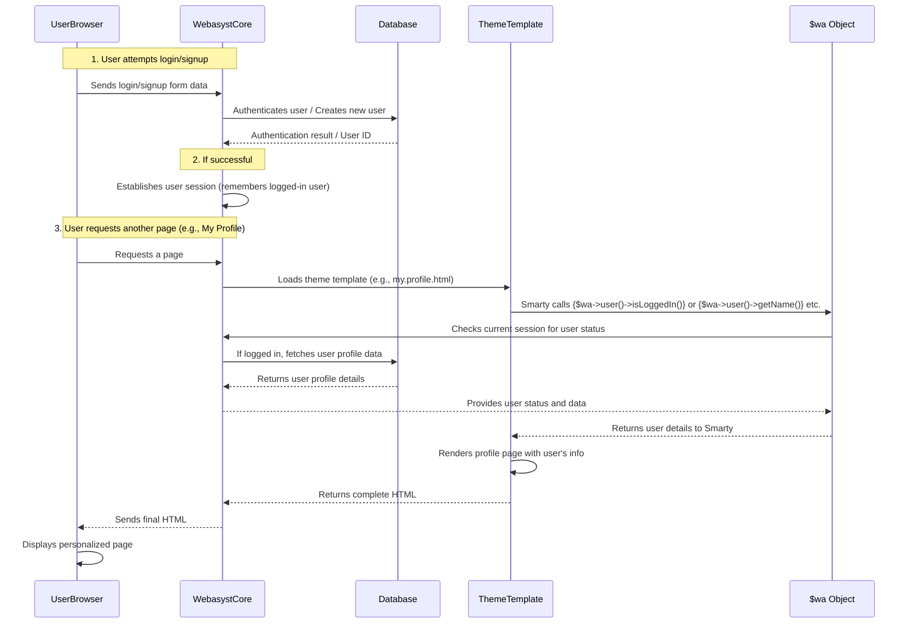

# Chapter 6: User Authentication and Profiles

In [Chapter 5: Application Integration](05_application_integration_.md), we learned how different parts of your Webasyst website, like a shop and a blog, can work together seamlessly. Now, let's add another crucial layer: personalizing the experience for individual visitors. What if you want to allow people to create their own accounts, log in securely, manage their personal details, or even recover a forgotten password?

This is where **User Authentication and Profiles** comes in!

## What is User Authentication and Profiles?

Imagine your website is a building.
*   **Authentication** is like a secure gatekeeper at the entrance. It checks your ID (username and password) to make sure you're allowed inside and verifies who you are. This ensures only authorized people can access certain areas, like their personal account or an exclusive members-only section.
*   **Profiles** are like a personal locker or file cabinet for each visitor. Once the gatekeeper lets them in, they have a dedicated space where their name, email, shipping address, or other personal preferences are stored and can be updated.

This system solves a big problem: without it, every user would be a nameless, faceless visitor. You couldn't offer personalized experiences, track orders, or protect sensitive information. Webasyst provides a built-in, centralized system for all these tasks, so you don't have to build complex login systems from scratch for every part of your website.

## How Webasyst Handles Users

Webasyst provides a robust framework for managing users, handling everything from creating accounts to secure logins and profile management. It uses the familiar `$wa` object (our "master key" from [Chapter 5: Application Integration](05_application_integration_.md)) to interact with user-related functions.

Let's look at the key pieces:

### 1. Login Pages

The login page is where users enter their username (or email) and password. Webasyst makes it easy to add this functionality to your theme.

**Location:** `wa-apps/site/themes/clear/login.html`

```smarty
<div class="content">
    <div id="page" role="main">
        <h1>[s`Login`]</h1>
        {$wa->authAdapters()} {* Displays social login buttons *}
        {$wa->loginForm($error, empty($without_form))} {* Displays the login form *}
    </div>
</div>
```

**Explanation:**
*   `[s`Login`]` is a special Webasyst tag for translatable text. For now, just think of it as the plain text "Login".
*   `{$wa->authAdapters()}`: This powerful function automatically displays buttons for social login services (like Google, Facebook) that you've enabled in your Webasyst backend. If a user clicks one, they can log in using their social media account, often without needing to create a separate password for your site!
*   `{$wa->loginForm($error, empty($without_form))}`: This function generates the standard HTML login form, complete with fields for username/email, password, and a "Remember me" checkbox. It also handles displaying any login errors (e.g., "Incorrect password").

### 2. Sign Up (Registration) Pages

The sign-up page allows new users to create an account on your website.

**Location:** `wa-apps/site/themes/clear/signup.html`

```smarty
<div class="content">
    <div id="page" role="main">
        {if !empty($contact)}
            <h1>[s`Thank you!`]</h1>
            <p>[s`You have successfully signed up.`]</p>
            {* ... more messages about email confirmation ... *}
        {else}
            <h1>[s`Sign up`]</h1>
            {$wa->authAdapters()} {* Social signup buttons *}
            {$wa->signupForm($errors)} {* The signup form *}
        {/if}
    </div>
</div>
```

**Explanation:**
*   This code uses an `{if}` statement to show different messages. If the user has just successfully signed up (`!empty($contact)`), it shows a "Thank you!" message.
*   Otherwise, it displays the "Sign up" heading.
*   `{$wa->authAdapters()}`: Again, this provides social login options, allowing users to quickly register using their existing social accounts.
*   `{$wa->signupForm($errors)}`: This generates the new user registration form, usually asking for details like name, email, and a new password. It automatically handles displaying any validation errors (e.g., "Email already taken").

### 3. Password Recovery Pages

What if a user forgets their password? Webasyst handles the "forgot password" process.

**Location:** `wa-apps/site/themes/clear/forgotpassword.html`

```smarty
<div class="content">
    <div id="page" role="main">
    {if !empty($set_password)}
        <h1>[s`Recover password for`] {$login}</h1>
        {$wa->setPasswordForm($error)} {* Form to set new password *}
    {else}
        <h1>[s`Password recovery`]</h1>
        {if !empty($sent)}
            <p>[s`Password recovery instructions have been sent to your email address.`]</p>
            <a href="{$wa->loginUrl()}">[s`Back to login page`]</a>
        {else}
            {$wa->forgotPasswordForm($error)} {* Form to request recovery email *}
        {/if}
    {/if}
    </div>
</div>
```

**Explanation:**
*   This template adapts based on the process stage.
*   `{$wa->forgotPasswordForm($error)}`: If a user just landed on the page, this displays a form asking for their email to send recovery instructions.
*   `!empty($sent)`: After the email is sent, a confirmation message is shown.
*   `!empty($set_password)`: If a user clicks a special link from the recovery email, they are taken back to this page, and `{$wa->setPasswordForm($error)}` is used to display a form allowing them to set a new password.

### 4. User Profile Pages

Once logged in, users can view and update their personal information.

**Location:** `wa-apps/site/themes/clear/my.profile.html` or `wa-apps/site/themes/default2/my.profile.html` (they are very similar)

```smarty
{$wa->myNav('menu-h bottom-padded')} {* Displays sub-navigation for profile section *}

<h1>[s`My profile`]</h1>

{if $saved}
    <strong><i class="icon16 saved"></i><span style="color:green">[s`Contact information successfully updated!`]</span></strong>
{/if}

<div id="wa-my-info-wrapper">
    <div class="wa-form" id="wa-my-info-read-wrapper">
        {foreach $user_info as $id => $info}
            <div class="wa-field">
                <div class="wa-name">{$info.name}</div>
                <div class="wa-value">{$info.value}</div>
            </div>
        {/foreach}
        <input type="button" class="button" id="wa-my-info-edit" value="[s`Edit`]"/>
    </div>

    <form action="" enctype="multipart/form-data" method="post" id="wa-my-info-edit-wrapper" style="display: none;">
        <div class="wa-form">
            {$form->html()} {* Displays the editable profile form *}
            <input type="submit" value="[s`Save`]">
            <a href="#" id="wa-my-info-cancel">[s`cancel`]</a>
        </div>
    </form>
</div>

{$auth_adapters = $wa->authAdapters(true)}
{if $auth_adapters}
    <h3>[s`Connected accounts`]</h3>
    {foreach $auth_adapters as $a}
        {if $wa->user("{$a->getId()}_id")}
            <li><span>getName()}" src="{$a->getIcon()}"/>{$a->getName()}</span></li> {* Linked account *}
        {else}
            <li><a href="{$a->getUrl()}">getName()}" src="{$a->getIcon()}"/>{$a->getName()}</a></li> {* Unlinked account *}
        {/if}
    {/foreach}
{/if}
```

**Explanation:**
*   `{$wa->myNav(...)`}: This generates a small sub-navigation menu typical for "My Account" areas (e.g., "My Profile", "My Orders" if Shop-Script is installed).
*   `$user_info`: This variable holds the user's current profile data in a ready-to-display format. The `{foreach}` loop iterates through it to show each piece of information (like name, email, phone).
*   `{$form->html()}`: This is a powerful command! Webasyst automatically generates a complete HTML form for editing the user's profile based on the configured user fields. This form is initially hidden and shown when the user clicks the "Edit" button (handled by the JavaScript at the bottom of the file).
*   **Connected Accounts:** The second part of the code (`{$auth_adapters = $wa->authAdapters(true)}...`) checks which social login providers are configured.
    *   `{$wa->user("{$a->getId()}_id")}`: This checks if the *current logged-in user* has linked their account to a specific social provider (like `facebook_id` or `google_id`).
    *   It then displays linked accounts (as plain text) or unlinked accounts (as clickable links) to allow users to connect new social accounts to their profile.

### 5. Checking User Status and Displaying Links

In your main theme files (like `header.section.html` or `content.html`), you'll often want to display "Login" or "My Profile" links depending on whether a user is logged in.

Here's how you might do that (often in `header.section.html`, simplified):

```smarty
{if $wa->user()->isLoggedIn()}
    {* User is logged in *}
    <a href="{$wa->getUrl('/frontend/myProfile')}">[`My Profile`]</a>
    <a href="{$wa->logoutUrl()}">[`Logout`]</a>
    <span>[s`Welcome,`] {$wa->user()->getName()}</span>
{else}
    {* User is not logged in *}
    <a href="{$wa->loginUrl()}">[`Login`]</a>
    <a href="{$wa->signupUrl()}">[`Sign up`]</a>
{/if}
```

**Explanation:**
*   `{$wa->user()->isLoggedIn()}`: This is the core check. It returns `true` if the current visitor is logged in, and `false` otherwise.
*   `$wa->getUrl('/frontend/myProfile')`: Generates the correct URL for the user's profile page.
*   `$wa->logoutUrl()`: Generates the URL to log the user out.
*   `$wa->loginUrl()`: Generates the URL for the login page.
*   `$wa->signupUrl()`: Generates the URL for the sign-up page.
*   `{$wa->user()->getName()}`: If logged in, this retrieves and displays the user's full name.

This allows your website to dynamically show the right links and greetings to your visitors, making the experience personal!

## Under the Hood: The Gatekeeper and the Locker

Let's see what happens behind the scenes when a user interacts with the authentication and profile system.



Here's a step-by-step breakdown:

1.  **Form Submission:** When a user fills out a login, signup, or password recovery form and submits it, the data is sent to the Webasyst backend.
2.  **Core Processing:** The Webasyst core system receives this data.
    *   **For Login:** It compares the provided username/password against the stored records in its database. If they match, the user is authenticated.
    *   **For Signup:** It creates a new user record in the database with the provided details.
    *   **For Password Recovery:** It finds the user's email, generates a unique secure link, and sends it to their email address.
3.  **Session Establishment:** If login/signup is successful, Webasyst establishes a "session." This is a way for the server to remember that this specific user is logged in across different pages, usually by setting a secure cookie in the user's browser.
4.  **Subsequent Page Loads:** For every page the user visits while logged in, Webasyst checks the session/cookie.
5.  **`$wa->user()` Object:** The `$wa->user()` object (accessible in your Smarty templates) is the key to getting user information. When you call functions like `$wa->user()->isLoggedIn()` or `$wa->user()->getName()`, the `$wa` object queries the Webasyst core.
6.  **Data Retrieval:** The Webasyst core system, aware of the user's session, fetches their specific profile data (name, email, etc.) from the database.
7.  **Template Rendering:** This user data is then made available to your theme's Smarty templates (e.g., `my.profile.html`), which use it to display personalized greetings, profile details, or appropriate navigation links.

This process ensures that your website can securely identify users, manage their personal information, and offer a personalized experience without you needing to handle complex security or database interactions directly in your templates.

## Conclusion

In this chapter, we've explored **User Authentication and Profiles** in `webasyst-framework`. We learned how Webasyst acts as a secure "gatekeeper" and "personal locker," enabling users to log in, sign up, recover passwords, and manage their personal information. We saw how Webasyst's built-in Smarty functions like `{$wa->loginForm()}`, `{$wa->signupForm()}`, and `{$wa->authAdapters()}` simplify the creation of these essential user-facing pages. We also understood how the `$wa->user()` object allows your theme to check login status and display personalized content, ensuring a secure and customized experience for every visitor.

Next, we'll dive into how to add dynamic, interactive elements to your website using JavaScript and other client-side tools in [Client-Side Scripting](07_client_side_scripting_.md).

---

<sub><sup>**References**: [[1]](https://github.com/webasyst/webasyst-framework/blob/321a9006a656fcf561c0295b87510be1e861d758/wa-apps/site/themes/clear/forgotpassword.html), [[2]](https://github.com/webasyst/webasyst-framework/blob/321a9006a656fcf561c0295b87510be1e861d758/wa-apps/site/themes/clear/login.html), [[3]](https://github.com/webasyst/webasyst-framework/blob/321a9006a656fcf561c0295b87510be1e861d758/wa-apps/site/themes/clear/my.nav.html), [[4]](https://github.com/webasyst/webasyst-framework/blob/321a9006a656fcf561c0295b87510be1e861d758/wa-apps/site/themes/clear/my.profile.html), [[5]](https://github.com/webasyst/webasyst-framework/blob/321a9006a656fcf561c0295b87510be1e861d758/wa-apps/site/themes/clear/signup.html), [[6]](https://github.com/webasyst/webasyst-framework/blob/321a9006a656fcf561c0295b87510be1e861d758/wa-apps/site/themes/default2/my.profile.html)</sup></sub>
