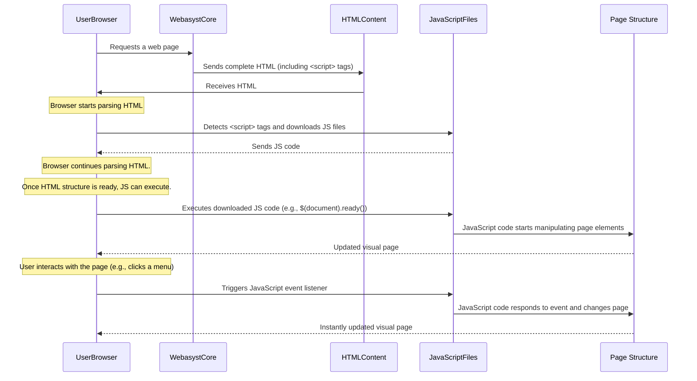

# Chapter 7: Client-Side Scripting

In [Chapter 6: User Authentication and Profiles](06_user_authentication_and_profiles_.md), we learned how Webasyst allows users to log in, manage their profiles, and receive a personalized experience. These features rely on the "server" (where your Webasyst website lives) processing requests and sending back full pages. But what if you want parts of your page to change *instantly*, without needing a full page reload? What if you want interactive buttons, animated elements, or content that appears magically when you click something?

This is where **Client-Side Scripting** comes in!

## What is Client-Side Scripting?

Imagine your website is a beautiful, printed book. Until now, all the "magic" happened when the book was printed (on the server). Client-side scripting is like adding little pop-up sections, interactive puzzles, or even animated characters *directly into the book after it's been given to the reader*. These special additions come to life right in the reader's hands (their web browser)!

Client-side scripting is about running code directly in the user's **web browser**, not on your server. This allows for:

*   **Dynamic Interactions:** Elements can respond to user clicks, mouse movements, or keyboard presses.
*   **Animations:** Smoothly changing colors, sizes, or positions of elements.
*   **Loading Data Without Reloads:** Fetching new information (like a product price update) without refreshing the entire page.
*   **Enhanced User Experience:** Making your website feel faster, more engaging, and more like a desktop application.

### The Problem It Solves

Think about a common website feature: a dropdown menu that appears when you hover over "Products," or a "Back to Top" button that smoothly scrolls the page when clicked.

*   **Without client-side scripting:** To make a dropdown menu appear, you'd technically have to reload the entire page with the menu visible, which would be slow and clunky. Clicking "Back to Top" would instantly jump, not smoothly scroll.
*   **With client-side scripting:** The browser handles these actions instantly. The menu appears right when you hover, the page scrolls smoothly, and form validations can happen *before* sending data to the server. This makes your website feel responsive and modern.

The primary language for client-side scripting is **JavaScript**. To make writing JavaScript easier and more consistent across different browsers, developers often use a powerful **JavaScript library** called **jQuery**. Webasyst themes use both to create interactive experiences.

## How Webasyst Uses Client-Side Scripting

Webasyst themes often include JavaScript files to add interactive features. These files are typically loaded right along with your theme's CSS styles and HTML structure.

### Including JavaScript Files in Your Theme

Just like how your theme's `index.html` includes CSS files (which we discussed in [Chapter 3: Themes (Design Families)](03_themes__design_families_.md)), it also includes JavaScript files using `<script>` tags.

Here's a simplified look at how JavaScript files are linked in `wa-apps/site/themes/clear/index.html`:

```html
    <!-- js -->
    <script src="{$wa_static_url}wa-content/js/jquery/jquery-1.11.1.min.js" ></script>
    <script src="{$wa_static_url}wa-content/js/jquery/jquery-migrate-1.2.1.min.js"></script>
    <script type="text/javascript" src="{$wa_theme_url}clear.js?v{$wa_theme_version}"></script>
    {$wa->js()} {* links active plugins JS *}
```

**Explanation:**

*   **`jquery-1.11.1.min.js` and `jquery-migrate-1.2.1.min.js`**: These are the core jQuery library files. Think of jQuery as a collection of pre-written JavaScript tools that make common tasks much simpler. For example, instead of writing many lines of complex JavaScript to find an element on a page and make it disappear, jQuery lets you do it in one or two lines. These files are loaded first because other scripts (like `clear.js`) might rely on jQuery.
*   **`clear.js?v{$wa_theme_version}`**: This is the theme-specific JavaScript file for the "Clear" theme (from `wa-apps/site/themes/clear/clear.js`). It contains custom scripts that add interactivity unique to this theme. The `?v{$wa_theme_version}` part helps ensure the browser always loads the latest version of the script when the theme is updated.
*   **`{$wa->js()}`**: Similar to `{$wa->css()}`, this Smarty function (from [Chapter 4: Templating System (Smarty)](04_templating_system__smarty_.md)) automatically includes JavaScript files from any active Webasyst plugins or applications. This allows applications (like Shop-Script) to add their own client-side logic without you manually adding `<script>` tags for them.

When your browser loads `index.html`, it downloads these JavaScript files. Once downloaded, the scripts start running in the browser, ready to make your page dynamic!

### Common Client-Side Interactions

Let's look at a few common examples from Webasyst themes to see how JavaScript (with jQuery) makes your website interactive.

#### 1. Responsive Navigation for Touch Devices (from `wa-apps/site/themes/clear/clear.js`)

Many themes need to behave differently on touchscreens. A common pattern is to make dropdown menus clickable instead of just appearing on hover.

Here's a simplified example of how `clear.js` might handle menu interactions for touch devices:

```javascript
( function($) {
    var is_touch_enabled = ("ontouchstart" in window);

    $(document).ready( function () {

        if (is_touch_enabled) {
            $(".app-navigation").on("click", ".menu-h.dropdown .collapsible", function(event) {
                event.preventDefault(); // Stop the link from going to a new page
                event.stopPropagation(); // Stop the click from affecting other elements

                var $li = $(this); // The menu item clicked

                // Check if the menu item is already open
                if ($li.hasClass("is-opened")) {
                    $li.removeClass("is-opened"); // Close it
                } else {
                    $li.addClass("is-opened");   // Open it
                }
            });
        }
    });
})(jQuery);
```

**Explanation:**

*   `( function($) { ... })(jQuery);` This is a common pattern to make sure the `$` symbol always refers to jQuery and avoids conflicts with other JavaScript libraries.
*   `$(document).ready(function () { ... });` This is a very important jQuery function. It ensures that the JavaScript code inside it only runs *after* the entire HTML page has been loaded and is ready to be interacted with.
*   `is_touch_enabled`: This variable checks if the user's browser supports touch events (i.e., if it's a touchscreen device).
*   `$(".app-navigation").on("click", ".menu-h.dropdown .collapsible", function(event) { ... });`: This is a jQuery "event listener."
    *   It listens for a `click` event on specific menu items (`.collapsible`) within the navigation.
    *   `event.preventDefault();` stops the browser from doing its default action (which for a link, is usually to navigate to the `href` URL).
    *   `$li.hasClass("is-opened")`: Checks if the clicked menu item already has the `is-opened` CSS class.
    *   `$li.removeClass("is-opened")` / `$li.addClass("is-opened")`: These jQuery functions dynamically add or remove a CSS class. The `is-opened` class would then have CSS rules (defined in `clear.css`) that make the dropdown menu visible or invisible.

This script makes menu items behave smartly: they toggle open/closed on a tap, preventing accidental navigation on touch devices.

#### 2. Sticky Elements on Scroll (from `wa-apps/site/themes/custom/custom.js` or `default2/default.js`)

Many websites feature elements that "stick" to the top of the screen as you scroll down (e.g., a mini shopping cart or a main navigation bar).

Here's a simplified version of this logic, seen in themes like "Custom" or "Default 2.0":

```javascript
$(document).ready(function () {

    // Listen for the window scrolling
    $(window).scroll(function() {
      	// If the user has scrolled down more than 35 pixels
      	if ( $(this).scrollTop() >= 35 ) {
            // And if the #cart element doesn't already have the 'fixed' class
            if (!$("#cart").hasClass('fixed')) {
              	$("#cart").addClass("fixed"); // Add the 'fixed' class
            }
    	}
    	// If the user scrolls back up and is less than 30 pixels from the top
    	else if ( $(this).scrollTop() < 30 ) {
    		$("#cart").removeClass("fixed"); // Remove the 'fixed' class
    	}
    });

});
```

**Explanation:**

*   `$(window).scroll(function() { ... });`: This jQuery function sets up an event listener that runs every time the user scrolls the browser window.
*   `$(this).scrollTop()`: This gets the current vertical scroll position of the window (how many pixels the user has scrolled down from the very top).
*   `$("#cart").addClass("fixed")` / `$("#cart").removeClass("fixed")`: These lines dynamically add or remove a CSS class named `fixed` to the HTML element with the ID `cart`. This `fixed` class would contain CSS rules (e.g., `position: fixed; top: 0;`) that make the cart element stick to the top of the screen.

This script creates a smooth, dynamic "sticky" effect for elements as the user scrolls, enhancing the user experience.

#### 3. Handling User Input (from `wa-apps/site/themes/default2/default.js` - Mailer App Example)

Client-side scripting is vital for improving forms, such as email subscription forms.

```javascript
    // MAILER app email subscribe form
    $('#mailer-subscribe-form').submit(function() {
        var form = $(this);
        var email_input = form.find('input[name="email"]');

        // Check if email input is empty BEFORE sending to server
        if (!email_input.val()) {
            email_input.addClass('error'); // Add error styling
            return false; // Stop form submission
        } else {
            email_input.removeClass('error'); // Remove error styling
        }

        // Show a loading indicator while waiting for response
        form.find('input[type="submit"]').hide();
        email_input.after('<i class="icon16 loading"></i>');

        // After the form submits and gets a response (via an iframe), hide the form and show thank you
        $('#mailer-subscribe-iframe').load(function() {
            $('#mailer-subscribe-form').hide();
            $('#mailer-subscribe-iframe').hide();
            $('#mailer-subscribe-thankyou').show();
        });
        // The form will now actually submit (if not stopped by the 'return false' above)
    });
```

**Explanation:**

*   `$('#mailer-subscribe-form').submit(function() { ... });`: This listens for when the form with ID `mailer-subscribe-form` is submitted.
*   `if (!email_input.val()) { ... }`: This is **client-side validation**. It checks if the email input field is empty *before* the form data is sent to the server.
    *   If empty, `email_input.addClass('error')` adds a visual error indicator, and `return false;` stops the form from being submitted to the server. This provides instant feedback to the user.
*   `form.find('input[type="submit"]').hide();` and `email_input.after('<i class="icon16 loading"></i>');`: These lines dynamically hide the submit button and show a loading icon, giving the user visual feedback that something is happening.
*   `$('#mailer-subscribe-iframe').load(function() { ... });`: This shows how JavaScript can react to the completion of an action (like a form submission via a hidden iframe) to display a thank-you message without reloading the main page.

This makes forms much more user-friendly by providing immediate feedback and visual cues.

## Under the Hood: How Scripts Come to Life

You've seen how JavaScript can add interactivity. Now, let's peek behind the curtain to understand *when* and *how* these scripts run.



Here's a step-by-step breakdown of how client-side scripting works:

1.  **Request and HTML Delivery:** When a user requests a page, Webasyst on your server generates and sends the complete HTML content (including all the `<script>` tags for JavaScript files) to the user's browser.
2.  **Browser Parsing:** The user's browser starts reading and understanding the HTML code.
3.  **JavaScript Download:** As the browser encounters `<script>` tags, it pauses parsing the HTML temporarily (or downloads them in the background, depending on script placement and attributes) and starts downloading the linked JavaScript files (like `jquery.min.js`, `clear.js`).
4.  **HTML Ready, JavaScript Executes:** Once the browser has finished parsing the main HTML structure of the page (which is what `$(document).ready()` waits for), the JavaScript code begins to execute.
    *   It sets up "event listeners" (like `$(window).scroll()` or `$(".menu").on("click")`) that wait for specific user actions.
    *   It might also perform initial actions, like adjusting element positions or animating something right when the page loads.
5.  **User Interaction:** The user interacts with the page (e.g., clicks a button, scrolls, types in a form field).
6.  **Script Responds:** When a user action matches an event that the JavaScript is "listening" for, the relevant JavaScript code runs *instantly* in the user's browser.
7.  **DOM Manipulation:** This JavaScript code directly manipulates the **DOM (Document Object Model)**. The DOM is the browser's internal representation of your web page's structure and content. By changing the DOM (e.g., adding a CSS class, changing text, hiding an element), the JavaScript can instantly update what the user sees on their screen, without contacting the server.

This continuous loop of event listening and DOM manipulation is what makes modern web pages so dynamic and interactive.

## Conclusion

In this chapter, we've explored **Client-Side Scripting** in `webasyst-framework`. We learned that it's code (primarily JavaScript with jQuery) that runs directly in the user's browser, enabling dynamic interactions, animations, and a smoother user experience without constant page reloads. We saw how Webasyst themes include these JavaScript files and how simple jQuery snippets can add powerful features like responsive navigation, sticky elements, and enhanced form validation. Understanding client-side scripting empowers you to make your Webasyst site more engaging and user-friendly.

Next, we'll build on this knowledge to understand how Webasyst helps your website look great on any device, from a large desktop monitor to a small smartphone screen, in [Adaptive/Responsive Design](08_adaptive_responsive_design_.md).

---

<sub><sup>**References**: [[1]](https://github.com/webasyst/webasyst-framework/blob/321a9006a656fcf561c0295b87510be1e861d758/wa-apps/site/themes/clear/clear.js), [[2]](https://github.com/webasyst/webasyst-framework/blob/321a9006a656fcf561c0295b87510be1e861d758/wa-apps/site/themes/clear/index.html), [[3]](https://github.com/webasyst/webasyst-framework/blob/321a9006a656fcf561c0295b87510be1e861d758/wa-apps/site/themes/custom/custom.js), [[4]](https://github.com/webasyst/webasyst-framework/blob/321a9006a656fcf561c0295b87510be1e861d758/wa-apps/site/themes/default2/default.js), [[5]](https://github.com/webasyst/webasyst-framework/blob/321a9006a656fcf561c0295b87510be1e861d758/wa-apps/site/themes/facebook/facebook.js), [[6]](https://github.com/webasyst/webasyst-framework/blob/321a9006a656fcf561c0295b87510be1e861d758/wa-apps/site/themes/mobile/mobile.js), [[7]](https://github.com/webasyst/webasyst-framework/blob/321a9006a656fcf561c0295b87510be1e861d758/wa-apps/site/themes/nifty/nifty.js), [[8]](https://github.com/webasyst/webasyst-framework/blob/321a9006a656fcf561c0295b87510be1e861d758/wa-apps/site/themes/sidebar/sidebar.js), [[9]](https://github.com/webasyst/webasyst-framework/blob/321a9006a656fcf561c0295b87510be1e861d758/wa-apps/site/themes/vk/vk.js)</sup></sub>
