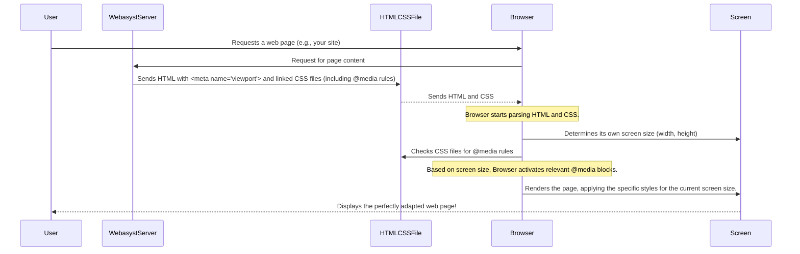

# Chapter 8: Adaptive/Responsive Design

In [Chapter 7: Client-Side Scripting](07_client_side_scripting_.md), we explored how JavaScript adds dynamic and interactive elements to your website, making things happen instantly in the user's browser. Now, let's tackle a visual challenge: how does your beautiful Webasyst website magically adjust itself to look great, whether someone is viewing it on a giant desktop monitor, a medium-sized tablet, or a tiny smartphone screen?

This is where **Adaptive/Responsive Design** comes in!

## What is Adaptive/Responsive Design?

Imagine you have a favorite outfit that magically changes its size and style to fit you perfectly, whether you've gained a few pounds or lost some, or whether you're going to a casual picnic or a fancy dinner. For websites, **Adaptive/Responsive Design** is exactly like that!

It's about making your website's layout, images, and text automatically adapt and look good on **any screen size or device**. No more squinting at tiny text on your phone or seeing huge, empty spaces on a large monitor!

### The Problem It Solves

Think about your website for a moment:
*   Someone visits it on a large desktop computer with a wide screen.
*   Another person visits on their tablet held horizontally.
*   A third person is browsing on their smartphone held vertically.

If your website isn't designed to adapt, it could look terrible on some of these devices! Text might be too small, images might get cut off, or content might be squashed or stretched awkwardly. This leads to a frustrating experience for your visitors, and they might just leave.

Webasyst themes solve this by providing built-in adaptive/responsive capabilities. When you activate a modern theme, it already "knows" how to rearrange itself to provide the best viewing experience on different devices.

## Key Concepts for Adaptive/Responsive Design

While Webasyst themes handle most of the heavy lifting, understanding the core tools they use will empower you to appreciate how this magic happens and even make your own tweaks later.

### 1. The Viewport Meta Tag

This is a tiny but incredibly important piece of code that lives in your website's `<head>` section. It tells mobile browsers how to display your page's width and scaling. Without it, mobile browsers often try to show the desktop version of your site, which looks tiny!

**Location:** Typically found in your theme's `index.html` file (e.g., `wa-apps/site/themes/default2/index.html`).

```html
<head>
    {* ... other head elements ... *}
    <meta name="viewport" content="width=device-width, initial-scale=1">
</head>
```

**Explanation:**
*   `width=device-width`: Tells the browser to set the width of the page to the width of the device's screen (not some default desktop width).
*   `initial-scale=1`: Tells the browser not to zoom in or out by default, but to display the page at 100% zoom.

This simple line ensures that your website takes up the full width of the mobile screen and doesn't appear tiny.

### 2. CSS Media Queries

This is the **heart** of responsive design. Media queries are special rules in your CSS (Cascading Style Sheets) that allow you to apply different styles based on the characteristics of the device, most commonly its screen width.

Think of them as "if-then" statements for your design:
*   **IF** the screen is small (like a phone), **THEN** make the text bigger and stack elements vertically.
*   **IF** the screen is medium (like a tablet), **THEN** arrange elements in two columns.
*   **IF** the screen is large (like a desktop), **THEN** use a three-column layout.

**Example from a Webasyst theme's CSS (simplified from `wa-apps/site/themes/clear/clear.css`):**

```css
/* Styles for screens smaller than 760px (mobile) */
@media screen and (max-width: 760px) {
    body {
        font-size: 12px; /* Make text a bit smaller for phones */
    }
    .container {
        padding: 15px; /* Adjust padding for smaller screens */
    }
    .sidebar.left {
        width: 100% !important; /* Make sidebar take full width */
        float: none !important; /* Remove floating, so it stacks */
        clear: both !important;
    }
    .content.left {
        margin-left: 0 !important; /* Remove margin from content, allow full width */
        clear: both !important;
    }
    .content img {
        max-width: 100%; /* Ensure images don't overflow */
        height: auto !important; /* Maintain aspect ratio */
    }
}
```

**Explanation:**
*   `@media screen and (max-width: 760px)`: This is the media query rule. It means: "Apply these styles only if the device is a screen (not print, etc.) AND its width is 760 pixels or less."
*   Inside the curly braces `{...}`, you put all the CSS rules that you want to change for that specific screen size.
*   `width: 100%`, `float: none`, `margin-left: 0`: These are common adjustments. On larger screens, a sidebar might float to the left with content beside it. On smaller screens, you'd want the sidebar and content to stack neatly, each taking up the full available width.
*   `max-width: 100%` for images: This is crucial! It ensures images will shrink to fit their container and never overflow, preventing horizontal scrolling on small devices.

### 3. Fluid Grids and Flexible Content

Beyond media queries, modern responsive design often uses:
*   **Fluid Grids:** Instead of fixed pixel widths, elements are given widths in percentages (`width: 50%`, `width: 100%`). This allows them to naturally stretch or shrink with the browser window, making the layout truly "fluid."
*   **Flexible Images/Media:** As seen above, `max-width: 100%` on images is a simple but powerful technique to ensure they scale down without breaking the layout.

## How Webasyst Themes Implement Responsive Design

Many Webasyst themes, such as the `Clear` theme or `Default 2.0` theme, are designed with responsive principles in mind. They incorporate the viewport meta tag and extensive CSS media queries to ensure your website looks great on a wide range of devices.

When you install and activate such a theme (as discussed in [Chapter 3: Themes (Design Families)](03_themes__design_families_.md)), this responsive functionality is automatically enabled for your website. You don't need to write any code yourself to get a mobile-friendly site!

### Responsive Theme Example (`Default 2.0` theme)

Let's look at another example from `wa-apps/site/themes/default2/default.css`. This theme specifically uses breakpoints to adjust its layout for tablets and phones:

```css
/* TABLET (760px to 1024px width) */
@media screen and (min-width: 760px) and (max-width: 1024px) {
    body {
        -webkit-text-size-adjust: 100%; /* Prevent automatic text size adjustment */
    }
    .container {
        padding: 0 10px; /* Adjust container padding */
    }
    /* ... more rules for tablet layout ... */
}

/* MOBILE (less than 760px width) */
@media screen and (max-width: 760px) {
    body {
        -webkit-text-size-adjust: 100%; /* Prevent automatic text size adjustment */
        padding-top: 55px; /* Adjust body padding for fixed header */
    }
    #globalnav {
        position: fixed; /* Make the main navigation stick to top */
        top: 0; left: 0; right: 0;
        height: 55px;
        /* ... other styles for fixed mobile header ... */
    }
    h1 { font-size: 1.5em; } /* Adjust heading sizes for mobile */
    h2 { font-size: 1.3em; }
    .container {
        min-width: 0; /* Remove minimum width constraint */
        padding: 0;
    }
    .sidebar.left,
    .sidebar.right {
        width: 100% !important; /* Sidebars take full width */
        float: none !important; /* No floating */
        clear: both !important;
    }
    .content img {
        max-width: 100%; height: auto !important; /* Ensure images fit */
    }
    /* ... many more rules to completely transform for mobile ... */
}
```

In this `Default 2.0` example:
*   It defines a range for "tablet" (between 760px and 1024px) and applies specific tweaks.
*   It then defines a "mobile" range (below 760px), where it makes more dramatic changes:
    *   Headings become smaller.
    *   The main navigation (`#globalnav`) becomes a "fixed" element at the top, allowing the user to scroll content underneath it.
    *   Sidebars are completely removed from their floating position and take up the full width, appearing above or below the main content.
    *   Images are guaranteed to fit.

This demonstrates how a single theme can intelligently reorganize and restyle itself for different screen environments using media queries.

### Adaptive vs. Responsive: A Quick Distinction (Theming Approach)

It's worth noting the subtle difference in how Webasyst themes might tackle device adaptation:

| Feature           | Responsive Theme (e.g., `Default 2.0`, `Clear`)                          | Adaptive Theme (e.g., `Mobile` theme)                                       |
| :---------------- | :----------------------------------------------------------------------- | :-------------------------------------------------------------------------- |
| **Approach**      | One theme, fluidly adjusts using CSS media queries.                      | Different themes served, or specific designs for distinct device types.      |
| **CSS Usage**     | Heavy use of `@media` rules to change layout/styles at various breakpoints. | Less reliance on `@media` within the theme itself, as it's designed for one device category. |
| **Flexibility**   | Highly flexible, handles a continuous range of screen sizes well.        | Optimized for specific device sizes/types, might not handle in-between sizes as gracefully. |
| **Webasyst Admin** | You select *one* responsive theme.                                     | You might set a `Default` theme for desktops and a `Mobile` theme for phones. |

While some older "adaptive" approaches involved serving entirely different HTML based on the user's device, modern Webasyst themes primarily use **responsive design** with media queries to adapt a single HTML structure. The `Mobile` theme is an example of an "adaptive" approach where it's specifically designed *only* for mobile and you'd typically enable it only for mobile visitors via Webasyst's routing settings.

## Under the Hood: How Your Browser Makes it Responsive

You've learned that Webasyst themes use CSS media queries. But how does this all translate into your website looking good on different devices? The magic truly happens inside the user's web browser.



Here's a step-by-step breakdown:

1.  **Request:** A user on any device (phone, tablet, desktop) requests a page from your Webasyst website.
2.  **Server Response:** Your Webasyst server sends the page's HTML (which includes the `<meta name="viewport">` tag) and links to the theme's CSS files.
3.  **Browser Reads HTML/CSS:** The user's browser starts reading the HTML and CSS. It sees the `viewport` meta tag and understands it should display the page at the device's actual width.
4.  **Screen Size Detection:** Crucially, the browser **knows its own screen size** (its current width and height).
5.  **Media Query Evaluation:** As the browser processes the CSS, it encounters the `@media` rules. For each rule, it asks: "Does my current screen size match the conditions of this media query (e.g., is `max-width: 760px` true for my screen)?"
6.  **Style Application:**
    *   If a media query's conditions are **true**, the browser applies all the CSS rules defined within that media query block.
    *   If the conditions are **false**, those rules are ignored.
    *   This happens dynamically! If you resize your browser window on a desktop, the browser continuously re-evaluates the media queries and instantly applies (or removes) styles, making the website "respond."
7.  **Render Page:** The browser then renders the page, applying the specific set of styles that are relevant to its current screen size, resulting in a perfectly adapted layout.

This process ensures that your Webasyst website seamlessly adjusts its appearance to fit any device, providing a consistent and user-friendly experience across the board.

## Conclusion

In this chapter, we've explored the crucial concept of **Adaptive/Responsive Design** in `webasyst-framework`. We learned that it's all about making your website's layout and appearance adjust automatically to any screen size, from desktops to smartphones. We discovered the fundamental tools used to achieve this: the **viewport meta tag** and powerful **CSS media queries**, which act as "if-then" rules for your design. We saw how Webasyst themes skillfully employ these techniques to provide ready-to-use responsive designs, ensuring your content looks fantastic on any device without extra effort on your part.

---

<sub><sup>**References**: [[1]](https://github.com/webasyst/webasyst-framework/blob/321a9006a656fcf561c0295b87510be1e861d758/wa-apps/site/themes/clear/clear.css), [[2]](https://github.com/webasyst/webasyst-framework/blob/321a9006a656fcf561c0295b87510be1e861d758/wa-apps/site/themes/custom/custom.css), [[3]](https://github.com/webasyst/webasyst-framework/blob/321a9006a656fcf561c0295b87510be1e861d758/wa-apps/site/themes/default2/default.css), [[4]](https://github.com/webasyst/webasyst-framework/blob/321a9006a656fcf561c0295b87510be1e861d758/wa-apps/site/themes/facebook/facebook.css), [[5]](https://github.com/webasyst/webasyst-framework/blob/321a9006a656fcf561c0295b87510be1e861d758/wa-apps/site/themes/mobile/mobile.css), [[6]](https://github.com/webasyst/webasyst-framework/blob/321a9006a656fcf561c0295b87510be1e861d758/wa-apps/site/themes/nifty/nifty.css), [[7]](https://github.com/webasyst/webasyst-framework/blob/321a9006a656fcf561c0295b87510be1e861d758/wa-apps/site/themes/sidebar/sidebar.css), [[8]](https://github.com/webasyst/webasyst-framework/blob/321a9006a656fcf561c0295b87510be1e861d758/wa-apps/site/themes/vk/vk.css)</sup></sub>
