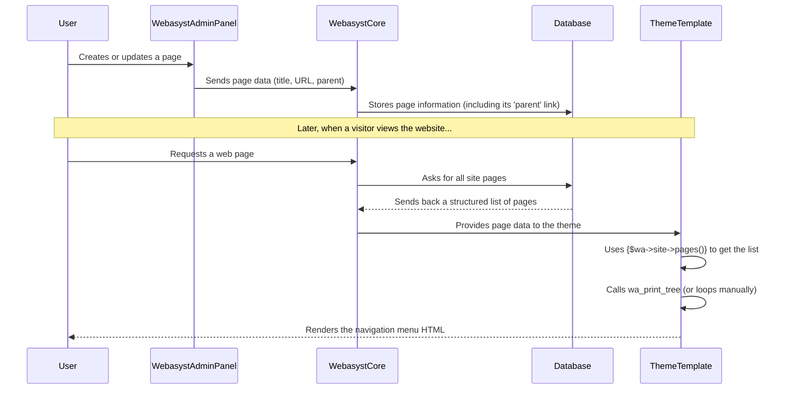

# Chapter 1: Site Structure & Navigation

Welcome, aspiring web developer, to your first step into the world of `webasyst-framework`! In this chapter, we're going to explore a fundamental concept: how your website's content is organized and how visitors find their way around it. Think of it like building a house – before you pick out furniture, you need to decide where the rooms are and how people will move between them.

## What is Site Structure & Navigation?

Imagine you're writing a book. You wouldn't just throw all your chapters onto one giant page, right? You'd have a Table of Contents, separate chapters, and maybe even sections within those chapters. Site Structure & Navigation in Webasyst is exactly like that for your website!

It's about:

*   **Organizing Content:** Arranging your website's information into logical sections and sub-sections.
*   **Hierarchy:** Creating a parent-child relationship between your pages, just like folders within folders on your computer. For example, a "Services" page might be the parent to "Web Design" and "SEO" sub-pages.
*   **Easy Browsing:** Making sure visitors can easily find what they're looking for by providing clear menus and links.

### The Problem It Solves

Let's say you're building a website for a small bakery. You need pages for:

*   "Home"
*   "About Us"
*   "Our Products"
    *   "Cakes"
    *   "Pastries"
    *   "Bread"
*   "Contact Us"

Without a good structure, all these pages would just be floating around, and your customers would have a hard time finding the "Cakes" menu! Webasyst's Site Structure helps you define these relationships, and then, magic happens: it can automatically create navigation menus for you!

## How to Set Up Your Site Structure

In Webasyst, your website's structure is built using "Pages." You manage these pages through the backend (admin area) of your Webasyst installation.

### Step-by-Step: Creating Pages

1.  **Log in to your Webasyst backend.**
2.  **Go to the "Site" application.** You'll usually see it in the left sidebar.
3.  **Click on "Pages."** This is where you see all your existing pages and can create new ones.
4.  **Click the "New Page" button.**
5.  **Give your page a Title** (e.g., "Our Products") and add some content.
6.  **Set its URL.** This is the web address for your page (e.g., `/products/`).
7.  **Save your page.**

To create sub-pages (like "Cakes" under "Our Products"):

1.  Create the "Cakes" page as above.
2.  Once created, drag and drop the "Cakes" page directly *under* the "Our Products" page in the "Pages" list. Webasyst will automatically update its hierarchy.

Now, your pages are organized!

## Building Navigation Menus

This is where the power of Webasyst's site structure truly shines. Once you've organized your pages, Webasyst can automatically generate navigation menus based on that structure.

Let's look at how your website's "theme" (which we'll cover in [Themes (Design Families)](03_themes__design_families_.md)) uses this structure to display menus.

Webasyst provides a special helper to display your site's pages as a navigation menu. You'll typically find this in files like `content.html` or `navigation.html` within your site theme.

Here's a simplified example from a theme file (like `wa-apps/site/themes/clear/content.html`):

```smarty
<div class="app-navigation" role="navigation">
	{wa_print_tree tree=$wa->site->pages() class="menu-h dropdown" elem ='<a href=":url">:name</a>'}
</div>
```

**Explanation:**

*   `wa_print_tree`: This is a special helper function provided by Webasyst (part of its [Templating System (Smarty)](04_templating_system__smarty_.md)). It's designed to take a list of hierarchical items (like your pages) and turn them into an HTML menu.
*   `tree=$wa->site->pages()`: This is the most important part!
    *   `$wa`: This is a global object in Webasyst that gives you access to various parts of your website.
    *   `$wa->site`: This specifically refers to the "Site" application's features.
    *   `$wa->site->pages()`: This command fetches *all* the pages you've created and organized in your backend, respecting their parent-child relationships. It gives `wa_print_tree` the data it needs.
*   `class="menu-h dropdown"`: These are HTML classes that help style the menu (e.g., make it horizontal, add dropdowns) using CSS.
*   `elem ='<a href=":url">:name</a>'`: This tells `wa_print_tree` how each individual page link should look.
    *   `:url` will be replaced with the page's web address.
    *   `:name` will be replaced with the page's title.

**What happens:** When your website loads, this code snippet asks Webasyst for all your pages. Then, `wa_print_tree` takes that list and automatically creates an unordered HTML list (`<ul>`) with nested list items (`<li>`) and links (`<a>`), forming your website's main navigation menu.

### Another Way: Manual Navigation (For Specific Needs)

Sometimes, you might want to display only certain pages or have more control over the menu structure. You can do this by getting the page data and looping through it yourself, as seen in `wa-apps/site/themes/facebook/content.html`:

```smarty
    {$pages = $wa->site->pages()}
    {if count($pages)}
        <ul class="menu-h">
        	{foreach $pages as $p}
        	   <li><a href="{$p.url}">{$p.name}</a></li>
        	{/foreach}
    	</ul>
	{/if}
```

**Explanation:**

*   `{$pages = $wa->site->pages()}`: This line still fetches all your pages, but instead of passing them directly to `wa_print_tree`, it stores them in a variable called `$pages`.
*   `{foreach $pages as $p}`: This loop then goes through each page (`$p`) in the `$pages` list.
*   `<li><a href="{$p.url}">{$p.name}</a></li>`: Inside the loop, you can manually build the HTML for each page link using its `url` and `name` properties. This gives you more flexibility if you need custom logic for your menu.

### Breadcrumbs: Helping Visitors Know Where They Are

Another common navigation element is "breadcrumbs," which show the path to the current page (e.g., "Home > Our Products > Cakes"). This is also automatically generated based on your site structure.

Here's an example from `wa-apps/site/themes/default2/page.html`:

```smarty
{if !empty($breadcrumbs)}
    <div class="breadcrumbs">
        {foreach $breadcrumbs as $breadcrumb}
            <a href="{$breadcrumb.url}">{$breadcrumb.name|escape}</a> <span class="rarr">&rarr;</span>
        {/foreach}
    </div>
{/if}
```

**Explanation:**

*   `$breadcrumbs`: Webasyst automatically populates this variable with an array of pages that represent the path from your homepage to the current page.
*   The `foreach` loop then displays each link in the path, making it easy for users to navigate back up the hierarchy.

## Under the Hood: How It Works

So, how does Webasyst do all this? Let's take a peek behind the curtain with a simple sequence of events:



1.  **You create pages:** When you create or update a page in the Webasyst admin panel, the system saves all its details (like its title, content, URL, and most importantly, *which other page it's a sub-page of*) into its database.
2.  **Webasyst "knows" your structure:** The database stores these relationships, allowing Webasyst to understand the complete hierarchy of your website.
3.  **When a visitor browses:** When someone visits your website, Webasyst's core system (`$wa->site`) fetches this entire organized list of pages from the database.
4.  **Themes use the data:** Your active website theme (specifically its template files like `content.html` or `navigation.html`) receives this structured page data.
5.  **Menus are built:** The template then uses the `wa_print_tree` helper or processes the data manually (as we saw with `foreach`) to convert this page structure into clickable HTML navigation menus.

This seamless process means you organize your content once, and Webasyst handles the heavy lifting of displaying navigable menus for your visitors.

## Conclusion

In this chapter, we've learned that Site Structure & Navigation is about organizing your website's content hierarchically, much like a book's table of contents. We saw how Webasyst allows you to create parent and sub-pages in the backend, and how its powerful templating system (with tools like `wa_print_tree` and `$wa->site->pages()`) automatically generates clear navigation menus for your visitors. This ensures your website is easy to browse and understand.

Next up, we'll dive into how the visual presentation of your pages is handled with different building blocks in [Page Layout Components](02_page_layout_components_.md).

---

<sub><sup>Generated by [AI Codebase Knowledge Builder](https://github.com/The-Pocket/Tutorial-Codebase-Knowledge).</sup></sub> <sub><sup>**References**: [[1]](https://github.com/webasyst/webasyst-framework/blob/321a9006a656fcf561c0295b87510be1e861d758/wa-apps/site/themes/clear/content.html), [[2]](https://github.com/webasyst/webasyst-framework/blob/321a9006a656fcf561c0295b87510be1e861d758/wa-apps/site/themes/clear/page.html), [[3]](https://github.com/webasyst/webasyst-framework/blob/321a9006a656fcf561c0295b87510be1e861d758/wa-apps/site/themes/custom/page.html), [[4]](https://github.com/webasyst/webasyst-framework/blob/321a9006a656fcf561c0295b87510be1e861d758/wa-apps/site/themes/default2/page.html), [[5]](https://github.com/webasyst/webasyst-framework/blob/321a9006a656fcf561c0295b87510be1e861d758/wa-apps/site/themes/facebook/content.html), [[6]](https://github.com/webasyst/webasyst-framework/blob/321a9006a656fcf561c0295b87510be1e861d758/wa-apps/site/themes/nifty/navigation.html), [[7]](https://github.com/webasyst/webasyst-framework/blob/321a9006a656fcf561c0295b87510be1e861d758/wa-apps/site/themes/sidebar/nav.sidebar.html)</sup></sub>
