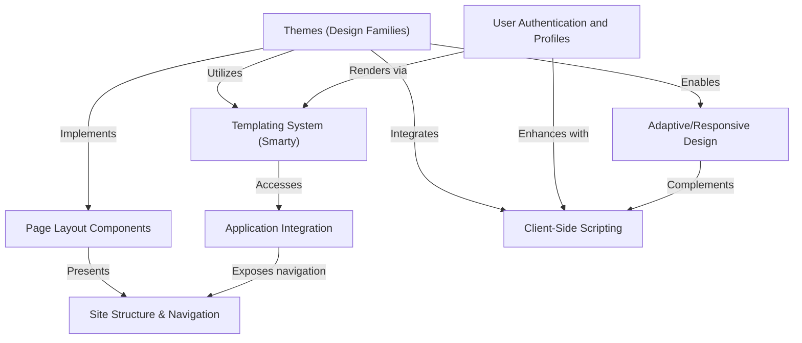

# Tutorial: webasyst-framework

Webasyst Framework is a robust platform designed for building versatile and dynamic websites. It allows users to create visually distinct sites using various **themes**, manage complex content layouts through **page layout components**, and enable interactive features via **client-side scripting**. The framework seamlessly integrates diverse **applications** (like e-commerce stores or blogs) and ensures a consistent user experience across devices through **adaptive/responsive design**, all powered by a flexible **templating system** and a secure **user authentication** mechanism.

## Visual Overview

## Chapters

1. [Site Structure & Navigation
](01_site_structure___navigation_.md)
2. [Page Layout Components
](02_page_layout_components_.md)
3. [Themes (Design Families)
](03_themes__design_families__.md)
4. [Templating System (Smarty)
](04_templating_system__smarty__.md)
5. [Application Integration
](05_application_integration_.md)
6. [User Authentication and Profiles
](06_user_authentication_and_profiles_.md)
7. [Client-Side Scripting
](07_client_side_scripting_.md)
8. [Adaptive/Responsive Design
](08_adaptive_responsive_design_.md)
